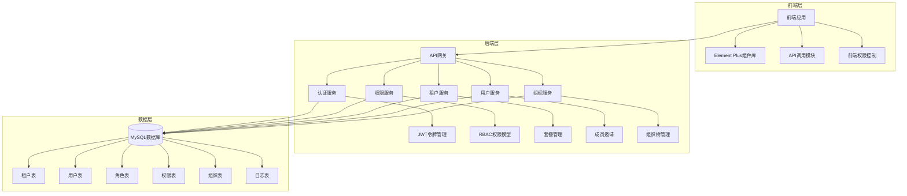
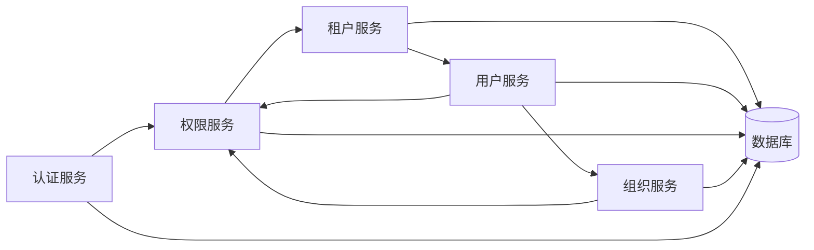
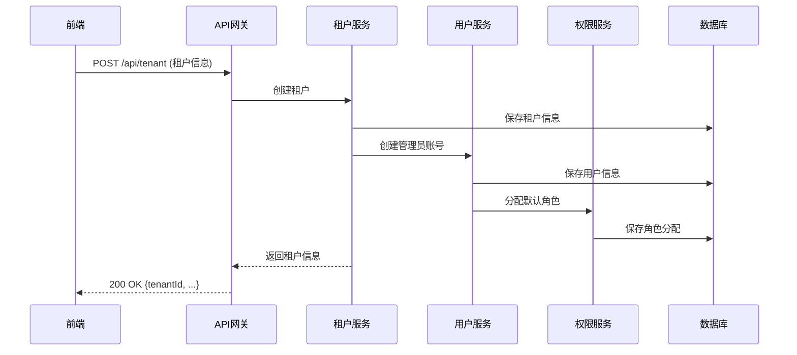
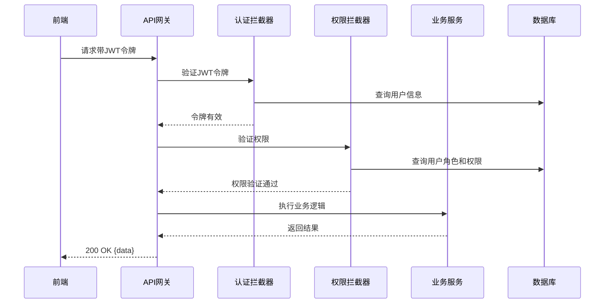

# 多租户权限管理系统技术架构设计文档

## 1. 整体架构设计

### 1.1 系统架构图

### 1.2 系统分层设计

| 层级 | 组件 | 职责 | 技术实现 |
| --- | --- | --- | --- |
| 前端层 | 前端应用 | 用户界面展示，权限控制 | Vue 3 + Element Plus |
| 前端层 | API调用模块 | 与后端API交互 | Axios |
| 前端层 | 前端权限控制 | 基于角色的前端权限管理 | 自定义权限指令 |
| 后端层 | API网关 | 请求路由，认证拦截 | Spring Boot Web |
| 后端层 | 认证服务 | 用户认证，JWT管理 | Spring Security |
| 后端层 | 权限服务 | 权限验证，角色管理 | 自定义权限框架 |
| 后端层 | 租户服务 | 租户管理，套餐管理 | Spring Boot Service |
| 后端层 | 用户服务 | 用户管理，成员邀请 | Spring Boot Service |
| 后端层 | 组织服务 | 组织架构管理 | Spring Boot Service |
| 数据层 | MySQL数据库 | 数据存储 | MySQL 8.0+ |

## 2. 核心组件定义

### 2.1 认证服务
- **JWT令牌管理**：生成和验证JWT令牌，包含用户信息和权限信息
- **认证拦截器**：拦截请求，验证JWT令牌有效性
- **用户认证**：验证用户凭据，处理登录和注销

### 2.2 权限服务
- **RBAC权限模型**：实现基于角色的访问控制
- **权限验证**：基于注解的方法级权限验证
- **角色管理**：角色的创建、编辑、删除和权限分配
- **权限管理**：权限的定义和管理

### 2.3 租户服务
- **租户管理**：租户的创建、编辑、状态管理
- **套餐管理**：套餐的定义、分配和生命周期管理
- **租户隔离**：确保不同租户数据隔离

### 2.4 用户服务
- **用户管理**：用户的创建、编辑、状态管理
- **成员邀请**：通过链接、邮箱、手机号邀请成员
- **用户角色分配**：为用户分配角色和权限

### 2.5 组织服务
- **组织架构管理**：搭建和管理多级组织架构
- **组织树管理**：组织架构的树形展示和操作
- **组织权限绑定**：将权限与组织架构绑定

## 3. 模块依赖关系图

## 4. 接口契约定义

### 4.1 租户管理接口

#### 4.1.1 创建租户
- **请求方式**：POST
- **接口路径**：/api/tenant
- **权限要求**：平台管理员
- **请求参数**：
  | 参数名 | 类型 | 必须 | 描述 |
  | --- | --- | --- | --- |
  | tenantName | String | 是 | 租户名称 |
  | tenantType | String | 是 | 租户类型（personal/team/enterprise） |
  | packageId | Long | 是 | 套餐ID |
  | adminUsername | String | 是 | 管理员用户名 |
  | adminPassword | String | 是 | 管理员密码 |
  | adminEmail | String | 是 | 管理员邮箱 |
  | adminPhone | String | 是 | 管理员手机号 |
- **返回参数**：
  | 参数名 | 类型 | 描述 |
  | --- | --- | --- |
  | code | Integer | 状态码 |
  | message | String | 消息 |
  | data | Object | 租户信息 |

#### 4.1.2 更新租户状态
- **请求方式**：PUT
- **接口路径**：/api/tenant/{id}/status
- **权限要求**：平台管理员
- **请求参数**：
  | 参数名 | 类型 | 必须 | 描述 |
  | --- | --- | --- | --- |
  | status | String | 是 | 状态（enabled/disabled/archived/deleted） |
- **返回参数**：
  | 参数名 | 类型 | 描述 |
  | --- | --- | --- |
  | code | Integer | 状态码 |
  | message | String | 消息 |

### 4.2 角色管理接口

#### 4.2.1 创建角色
- **请求方式**：POST
- **接口路径**：/api/role
- **权限要求**：租户管理员
- **请求参数**：
  | 参数名 | 类型 | 必须 | 描述 |
  | --- | --- | --- | --- |
  | roleName | String | 是 | 角色名称 |
  | description | String | 否 | 角色描述 |
  | tenantId | Long | 是 | 租户ID |
  | isSystem | Boolean | 是 | 是否系统角色 |
- **返回参数**：
  | 参数名 | 类型 | 描述 |
  | --- | --- | --- |
  | code | Integer | 状态码 |
  | message | String | 消息 |
  | data | Object | 角色信息 |

#### 4.2.2 分配权限
- **请求方式**：POST
- **接口路径**：/api/role/{id}/permissions
- **权限要求**：租户管理员
- **请求参数**：
  | 参数名 | 类型 | 必须 | 描述 |
  | --- | --- | --- | --- |
  | permissionIds | List<Long> | 是 | 权限ID列表 |
- **返回参数**：
  | 参数名 | 类型 | 描述 |
  | --- | --- | --- |
  | code | Integer | 状态码 |
  | message | String | 消息 |

### 4.3 用户管理接口

#### 4.3.1 邀请成员
- **请求方式**：POST
- **接口路径**：/api/user/invite
- **权限要求**：租户管理员
- **请求参数**：
  | 参数名 | 类型 | 必须 | 描述 |
  | --- | --- | --- | --- |
  | type | String | 是 | 邀请方式（link/email/phone） |
  | target | String | 是 | 邀请目标（邮箱/手机号） |
  | roleIds | List<Long> | 是 | 角色ID列表 |
  | expireTime | Long | 是 | 邀请过期时间 |
- **返回参数**：
  | 参数名 | 类型 | 描述 |
  | --- | --- | --- |
  | code | Integer | 状态码 |
  | message | String | 消息 |
  | data | Object | 邀请信息 |

### 4.4 组织管理接口

#### 4.4.1 创建组织
- **请求方式**：POST
- **接口路径**：/api/organization
- **权限要求**：租户管理员
- **请求参数**：
  | 参数名 | 类型 | 必须 | 描述 |
  | --- | --- | --- | --- |
  | orgName | String | 是 | 组织名称 |
  | parentId | Long | 否 | 父组织ID |
  | orgType | String | 是 | 组织类型 |
  | tenantId | Long | 是 | 租户ID |
- **返回参数**：
  | 参数名 | 类型 | 描述 |
  | --- | --- | --- |
  | code | Integer | 状态码 |
  | message | String | 消息 |
  | data | Object | 组织信息 |

## 5. 核心业务数据流向图

### 5.1 租户创建流程

### 5.2 权限验证流程

## 6. 数据库表结构设计

### 6.1 租户相关表

#### 6.1.1 租户表 (tenant)
| 字段名 | 数据类型 | 约束 | 描述 |
| --- | --- | --- | --- |
| id | BIGINT | PRIMARY KEY | 租户ID |
| tenant_name | VARCHAR(100) | NOT NULL | 租户名称 |
| tenant_type | VARCHAR(20) | NOT NULL | 租户类型（personal/team/enterprise） |
| status | VARCHAR(20) | NOT NULL | 状态（enabled/disabled/archived/deleted） |
| package_id | BIGINT | FOREIGN KEY | 套餐ID |
| expire_time | DATETIME | | 过期时间 |
| created_at | DATETIME | NOT NULL | 创建时间 |
| updated_at | DATETIME | NOT NULL | 更新时间 |

#### 6.1.2 租户套餐表 (tenant_package)
| 字段名 | 数据类型 | 约束 | 描述 |
| --- | --- | --- | --- |
| id | BIGINT | PRIMARY KEY | 套餐ID |
| package_name | VARCHAR(100) | NOT NULL | 套餐名称 |
| user_limit | INT | NOT NULL | 用户数量上限 |
| feature_limit | VARCHAR(255) | | 功能限制 |
| price | DECIMAL(10,2) | NOT NULL | 价格 |
| created_at | DATETIME | NOT NULL | 创建时间 |
| updated_at | DATETIME | NOT NULL | 更新时间 |

### 6.2 权限相关表

#### 6.2.1 角色表 (role)
| 字段名 | 数据类型 | 约束 | 描述 |
| --- | --- | --- | --- |
| id | BIGINT | PRIMARY KEY | 角色ID |
| role_name | VARCHAR(100) | NOT NULL | 角色名称 |
| description | VARCHAR(255) | | 角色描述 |
| tenant_id | BIGINT | FOREIGN KEY | 租户ID |
| is_system | BOOLEAN | NOT NULL | 是否系统角色 |
| is_enabled | BOOLEAN | NOT NULL | 是否启用 |
| created_at | DATETIME | NOT NULL | 创建时间 |
| updated_at | DATETIME | NOT NULL | 更新时间 |

#### 6.2.2 权限表 (permission)
| 字段名 | 数据类型 | 约束 | 描述 |
| --- | --- | --- | --- |
| id | BIGINT | PRIMARY KEY | 权限ID |
| permission_name | VARCHAR(100) | NOT NULL | 权限名称 |
| permission_code | VARCHAR(100) | NOT NULL | 权限代码 |
| description | VARCHAR(255) | | 权限描述 |
| permission_type | VARCHAR(20) | NOT NULL | 权限类型（function/data/operation/resource） |
| is_enabled | BOOLEAN | NOT NULL | 是否启用 |
| created_at | DATETIME | NOT NULL | 创建时间 |
| updated_at | DATETIME | NOT NULL | 更新时间 |

#### 6.2.3 角色权限关联表 (role_permission)
| 字段名 | 数据类型 | 约束 | 描述 |
| --- | --- | --- | --- |
| id | BIGINT | PRIMARY KEY | ID |
| role_id | BIGINT | FOREIGN KEY | 角色ID |
| permission_id | BIGINT | FOREIGN KEY | 权限ID |

#### 6.2.4 用户角色关联表 (user_role)
| 字段名 | 数据类型 | 约束 | 描述 |
| --- | --- | --- | --- |
| id | BIGINT | PRIMARY KEY | ID |
| user_id | BIGINT | FOREIGN KEY | 用户ID |
| role_id | BIGINT | FOREIGN KEY | 角色ID |
| effective_time | DATETIME | | 生效时间 |
| expire_time | DATETIME | | 失效时间 |
| created_at | DATETIME | NOT NULL | 创建时间 |

### 6.3 组织相关表

#### 6.3.1 组织表 (organization)
| 字段名 | 数据类型 | 约束 | 描述 |
| --- | --- | --- | --- |
| id | BIGINT | PRIMARY KEY | 组织ID |
| tenant_id | BIGINT | FOREIGN KEY | 租户ID |
| parent_id | BIGINT | FOREIGN KEY | 父组织ID |
| org_name | VARCHAR(100) | NOT NULL | 组织名称 |
| org_type | VARCHAR(20) | NOT NULL | 组织类型 |
| created_at | DATETIME | NOT NULL | 创建时间 |
| updated_at | DATETIME | NOT NULL | 更新时间 |

#### 6.3.2 用户组织关联表 (user_organization)
| 字段名 | 数据类型 | 约束 | 描述 |
| --- | --- | --- | --- |
| id | BIGINT | PRIMARY KEY | ID |
| user_id | BIGINT | FOREIGN KEY | 用户ID |
| org_id | BIGINT | FOREIGN KEY | 组织ID |
| position | VARCHAR(100) | | 职位 |
| created_at | DATETIME | NOT NULL | 创建时间 |

### 6.4 日志相关表

#### 6.4.1 登录日志表 (login_log)
| 字段名 | 数据类型 | 约束 | 描述 |
| --- | --- | --- | --- |
| id | BIGINT | PRIMARY KEY | ID |
| user_id | BIGINT | FOREIGN KEY | 用户ID |
| tenant_id | BIGINT | FOREIGN KEY | 租户ID |
| login_time | DATETIME | NOT NULL | 登录时间 |
| login_ip | VARCHAR(50) | NOT NULL | 登录IP |
| login_device | VARCHAR(100) | | 登录设备 |
| login_result | VARCHAR(20) | NOT NULL | 登录结果（success/fail） |
| fail_reason | VARCHAR(255) | | 失败原因 |

#### 6.4.2 操作日志表 (operation_log)
| 字段名 | 数据类型 | 约束 | 描述 |
| --- | --- | --- | --- |
| id | BIGINT | PRIMARY KEY | ID |
| user_id | BIGINT | FOREIGN KEY | 用户ID |
| tenant_id | BIGINT | FOREIGN KEY | 租户ID |
| operation_time | DATETIME | NOT NULL | 操作时间 |
| operation_type | VARCHAR(50) | NOT NULL | 操作类型 |
| operation_target | VARCHAR(100) | NOT NULL | 操作目标 |
| operation_content | TEXT | | 操作内容 |
| result | VARCHAR(20) | NOT NULL | 操作结果（success/fail） |

## 7. 全局异常处理策略

### 7.1 异常分类
- **业务异常**：如参数校验失败、权限不足等
- **系统异常**：如数据库连接失败、服务调用失败等
- **安全异常**：如认证失败、恶意请求等

### 7.2 处理机制
- **统一异常处理器**：捕获所有异常，返回标准化错误响应
- **异常日志记录**：详细记录异常信息，便于排查
- **错误码体系**：建立统一的错误码体系，便于前端处理
- **降级方案**：在系统异常时提供降级服务，确保核心功能可用

## 8. 安全设计与合规适配方案

### 8.1 安全设计
- **JWT认证**：使用JWT进行无状态认证，减少服务器存储压力
- **密码加密**：使用BCrypt等算法加密存储密码
- **HTTPS传输**：所有API请求使用HTTPS传输，确保数据安全
- **权限验证**：基于注解的方法级权限验证，确保权限控制粒度
- **SQL注入防护**：使用JPA和参数化查询，防止SQL注入
- **XSS防护**：对用户输入进行过滤和转义，防止XSS攻击

### 8.2 合规适配
- **数据隔离**：严格的租户数据隔离，确保数据隐私
- **审计日志**：详细记录所有敏感操作，支持合规审计
- **数据备份**：定期数据备份，确保数据安全
- **数据导出**：支持数据导出，满足合规要求
- **私有化部署**：支持私有化部署，满足特定行业合规要求

## 9. 性能优化方案

### 9.1 前端优化
- **组件懒加载**：按需加载组件，减少初始加载时间
- **缓存策略**：合理使用浏览器缓存和本地存储
- **请求优化**：合并请求，减少HTTP请求次数
- **渲染优化**：使用虚拟列表，优化大数据渲染

### 9.2 后端优化
- **缓存机制**：使用Redis缓存热点数据和权限信息
- **数据库优化**：合理设计索引，优化查询语句
- **异步处理**：使用消息队列处理异步任务，提高系统响应速度
- **连接池**：使用数据库连接池，减少连接开销
- **限流策略**：实现API限流，防止恶意请求

### 9.3 数据库优化
- **分库分表**：针对大租户数据量增长，考虑分库分表
- **读写分离**：实现读写分离，提高数据库并发能力
- **索引优化**：合理设计索引，提高查询性能
- **批量操作**：使用批量操作减少数据库交互次数

## 10. 部署与集成方案

### 10.1 部署架构
- **容器化部署**：使用Docker容器化部署，便于管理和扩展
- **微服务架构**：将系统拆分为多个微服务，提高系统可维护性和可扩展性
- **负载均衡**：使用负载均衡器，提高系统可用性
- **监控系统**：部署监控系统，实时监控系统运行状态

### 10.2 集成方案
- **与现有系统集成**：通过API接口与现有系统集成
- **第三方服务集成**：集成邮件服务、短信服务等第三方服务
- **单点登录**：支持与企业现有认证系统集成，实现单点登录

## 11. 技术栈与依赖

| 技术/依赖 | 版本 | 用途 |
| --- | --- | --- |
| Spring Boot | 3.2.0 | 后端框架 |
| Spring Data JPA | 3.2.0 | ORM框架 |
| Spring Security | 3.2.0 | 安全框架 |
| MySQL | 8.0+ | 数据库 |
| Vue 3 | 3.3.0 | 前端框架 |
| Element Plus | 2.4.0 | UI组件库 |
| Axios | 1.6.0 | HTTP客户端 |
| JWT | 0.11.2 | 认证令牌 |
| Redis | 7.0+ | 缓存 |
| Docker | 20.10+ | 容器化 |

## 12. 开发与测试计划

### 12.1 开发计划
- **后端开发**：实现核心服务和API接口
- **前端开发**：实现用户界面和交互逻辑
- **集成测试**：测试系统集成和功能验证
- **性能测试**：测试系统性能和稳定性

### 12.2 测试计划
- **单元测试**：测试核心功能和组件
- **集成测试**：测试模块间集成
- **端到端测试**：测试完整业务流程
- **安全测试**：测试系统安全性
- **性能测试**：测试系统性能和并发能力

## 13. 风险与应对策略

| 风险 | 应对策略 |
| --- | --- |
| 权限验证性能瓶颈 | 优化权限验证算法，使用缓存机制 |
| 租户数据量增长 | 数据库分库分表，优化查询性能 |
| 权限配置不当 | 权限配置审核机制，定期权限审计 |
| 系统安全漏洞 | 定期安全扫描，及时修复漏洞 |
| 服务可用性 | 实现高可用架构，减少单点故障 |

## 14. 未来扩展规划

- **多语言支持**：支持多语言界面和国际化
- **多因素认证**：支持短信验证码、邮箱验证等多因素认证
- **API网关**：引入专业API网关，提供更强大的路由和限流功能
- **事件驱动架构**：引入事件驱动架构，提高系统可扩展性
- **AI辅助**：引入AI辅助功能，如智能权限推荐、异常检测等