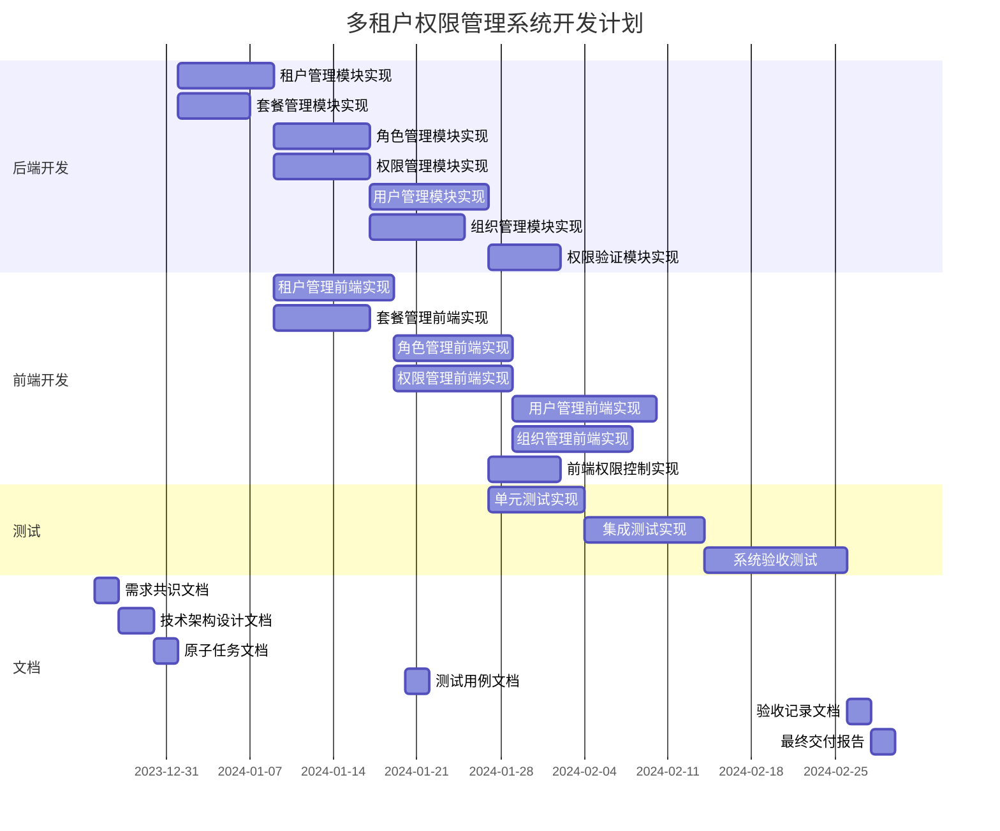

# 多租户权限管理系统原子任务文档

## 1. 任务拆分总览

### 1.1 任务拆分原则
- **原子性**：每个任务独立可执行，不依赖其他任务的内部实现
- **可验收性**：每个任务有明确的验收标准
- **粒度适中**：任务大小适中，便于管理和追踪
- **全角色覆盖**：覆盖前端、后端、测试等所有角色

### 1.2 任务分类
- **后端任务**：实现核心服务和API接口
- **前端任务**：实现用户界面和交互逻辑
- **测试任务**：验证系统功能和性能

## 2. 原子任务详细定义

### 2.1 后端任务

#### 任务1：租户管理模块实现
- **任务ID**：BT-001
- **所属模块**：租户管理
- **负责角色**：后端开发
- **预估工时**：8小时
- **优先级**：高
- **输入契约**：
  - 前置依赖：数据库表结构设计
  - 输入数据：租户创建请求参数
  - 环境依赖：Spring Boot环境、MySQL数据库
  - 必须读取的文档：`DESIGN_multi-tenant-permission.md`
- **输出契约**：
  - 交付物：租户管理服务、租户管理控制器
  - 输出数据：租户CRUD API接口
  - 验收标准：租户创建、更新、查询、状态管理功能正常
  - 必须同步更新的文档：`MODIFICATION_HISTORY_tenant.md`
- **实现约束**：
  - 规范要求：遵循Spring Boot编码规范
  - 技术栈：Spring Boot 3.2.0 + Spring Data JPA
  - 质量标准：代码覆盖率≥80%
- **依赖关系**：
  - 前置依赖：数据库表结构创建
  - 可并行任务：套餐管理模块实现
  - 后置关联任务：前端租户管理界面实现

#### 任务2：套餐管理模块实现
- **任务ID**：BT-002
- **所属模块**：套餐管理
- **负责角色**：后端开发
- **预估工时**：6小时
- **优先级**：高
- **输入契约**：
  - 前置依赖：数据库表结构设计
  - 输入数据：套餐创建请求参数
  - 环境依赖：Spring Boot环境、MySQL数据库
  - 必须读取的文档：`DESIGN_multi-tenant-permission.md`
- **输出契约**：
  - 交付物：套餐管理服务、套餐管理控制器
  - 输出数据：套餐CRUD API接口
  - 验收标准：套餐创建、更新、查询功能正常
  - 必须同步更新的文档：`MODIFICATION_HISTORY_package.md`
- **实现约束**：
  - 规范要求：遵循Spring Boot编码规范
  - 技术栈：Spring Boot 3.2.0 + Spring Data JPA
  - 质量标准：代码覆盖率≥80%
- **依赖关系**：
  - 前置依赖：数据库表结构创建
  - 可并行任务：租户管理模块实现
  - 后置关联任务：前端套餐管理界面实现

#### 任务3：角色管理模块实现
- **任务ID**：BT-003
- **所属模块**：角色管理
- **负责角色**：后端开发
- **预估工时**：8小时
- **优先级**：高
- **输入契约**：
  - 前置依赖：数据库表结构设计
  - 输入数据：角色创建请求参数
  - 环境依赖：Spring Boot环境、MySQL数据库
  - 必须读取的文档：`DESIGN_multi-tenant-permission.md`
- **输出契约**：
  - 交付物：角色管理服务、角色管理控制器
  - 输出数据：角色CRUD API接口
  - 验收标准：角色创建、更新、查询功能正常
  - 必须同步更新的文档：`MODIFICATION_HISTORY_role.md`
- **实现约束**：
  - 规范要求：遵循Spring Boot编码规范
  - 技术栈：Spring Boot 3.2.0 + Spring Data JPA
  - 质量标准：代码覆盖率≥80%
- **依赖关系**：
  - 前置依赖：数据库表结构创建
  - 可并行任务：权限管理模块实现
  - 后置关联任务：前端角色管理界面实现

#### 任务4：权限管理模块实现
- **任务ID**：BT-004
- **所属模块**：权限管理
- **负责角色**：后端开发
- **预估工时**：8小时
- **优先级**：高
- **输入契约**：
  - 前置依赖：数据库表结构设计
  - 输入数据：权限创建请求参数
  - 环境依赖：Spring Boot环境、MySQL数据库
  - 必须读取的文档：`DESIGN_multi-tenant-permission.md`
- **输出契约**：
  - 交付物：权限管理服务、权限管理控制器
  - 输出数据：权限CRUD API接口
  - 验收标准：权限创建、更新、查询功能正常
  - 必须同步更新的文档：`MODIFICATION_HISTORY_permission.md`
- **实现约束**：
  - 规范要求：遵循Spring Boot编码规范
  - 技术栈：Spring Boot 3.2.0 + Spring Data JPA
  - 质量标准：代码覆盖率≥80%
- **依赖关系**：
  - 前置依赖：数据库表结构创建
  - 可并行任务：角色管理模块实现
  - 后置关联任务：前端权限管理界面实现

#### 任务5：用户管理模块实现
- **任务ID**：BT-005
- **所属模块**：用户管理
- **负责角色**：后端开发
- **预估工时**：10小时
- **优先级**：高
- **输入契约**：
  - 前置依赖：数据库表结构设计
  - 输入数据：用户创建、邀请请求参数
  - 环境依赖：Spring Boot环境、MySQL数据库
  - 必须读取的文档：`DESIGN_multi-tenant-permission.md`
- **输出契约**：
  - 交付物：用户管理服务、用户管理控制器
  - 输出数据：用户CRUD、邀请API接口
  - 验收标准：用户创建、更新、查询、邀请功能正常
  - 必须同步更新的文档：`MODIFICATION_HISTORY_user.md`
- **实现约束**：
  - 规范要求：遵循Spring Boot编码规范
  - 技术栈：Spring Boot 3.2.0 + Spring Data JPA
  - 质量标准：代码覆盖率≥80%
- **依赖关系**：
  - 前置依赖：角色管理模块实现
  - 可并行任务：组织管理模块实现
  - 后置关联任务：前端用户管理界面实现

#### 任务6：组织管理模块实现
- **任务ID**：BT-006
- **所属模块**：组织管理
- **负责角色**：后端开发
- **预估工时**：8小时
- **优先级**：中
- **输入契约**：
  - 前置依赖：数据库表结构设计
  - 输入数据：组织创建请求参数
  - 环境依赖：Spring Boot环境、MySQL数据库
  - 必须读取的文档：`DESIGN_multi-tenant-permission.md`
- **输出契约**：
  - 交付物：组织管理服务、组织管理控制器
  - 输出数据：组织CRUD API接口
  - 验收标准：组织创建、更新、查询、树形结构功能正常
  - 必须同步更新的文档：`MODIFICATION_HISTORY_organization.md`
- **实现约束**：
  - 规范要求：遵循Spring Boot编码规范
  - 技术栈：Spring Boot 3.2.0 + Spring Data JPA
  - 质量标准：代码覆盖率≥80%
- **依赖关系**：
  - 前置依赖：数据库表结构创建
  - 可并行任务：用户管理模块实现
  - 后置关联任务：前端组织管理界面实现

#### 任务7：权限验证模块实现
- **任务ID**：BT-007
- **所属模块**：权限验证
- **负责角色**：后端开发
- **预估工时**：6小时
- **优先级**：高
- **输入契约**：
  - 前置依赖：角色管理模块实现、权限管理模块实现
  - 输入数据：权限验证请求
  - 环境依赖：Spring Boot环境
  - 必须读取的文档：`DESIGN_multi-tenant-permission.md`
- **输出契约**：
  - 交付物：权限注解、权限拦截器
  - 输出数据：权限验证功能
  - 验收标准：权限验证准确有效，性能符合要求
  - 必须同步更新的文档：`MODIFICATION_HISTORY_permission.md`
- **实现约束**：
  - 规范要求：遵循Spring Boot编码规范
  - 技术栈：Spring Boot 3.2.0 + Spring Security
  - 质量标准：代码覆盖率≥80%
- **依赖关系**：
  - 前置依赖：角色管理模块实现、权限管理模块实现
  - 可并行任务：前端权限控制实现
  - 后置关联任务：系统集成测试

### 2.2 前端任务

#### 任务8：租户管理前端实现
- **任务ID**：FT-001
- **所属模块**：租户管理
- **负责角色**：前端开发
- **预估工时**：10小时
- **优先级**：高
- **输入契约**：
  - 前置依赖：租户管理API接口
  - 输入数据：租户管理界面设计
  - 环境依赖：Vue 3环境、Element Plus
  - 必须读取的文档：`DESIGN_multi-tenant-permission.md`
- **输出契约**：
  - 交付物：租户管理组件、租户表单组件
  - 输出数据：租户管理界面
  - 验收标准：界面功能完整，交互流畅
  - 必须同步更新的文档：`MODIFICATION_HISTORY_frontend.md`
- **实现约束**：
  - 规范要求：遵循Vue 3编码规范
  - 技术栈：Vue 3 + Element Plus
  - 质量标准：界面美观，交互流畅
- **依赖关系**：
  - 前置依赖：租户管理API接口
  - 可并行任务：套餐管理前端实现
  - 后置关联任务：系统集成测试

#### 任务9：套餐管理前端实现
- **任务ID**：FT-002
- **所属模块**：套餐管理
- **负责角色**：前端开发
- **预估工时**：8小时
- **优先级**：中
- **输入契约**：
  - 前置依赖：套餐管理API接口
  - 输入数据：套餐管理界面设计
  - 环境依赖：Vue 3环境、Element Plus
  - 必须读取的文档：`DESIGN_multi-tenant-permission.md`
- **输出契约**：
  - 交付物：套餐管理组件、套餐表单组件
  - 输出数据：套餐管理界面
  - 验收标准：界面功能完整，交互流畅
  - 必须同步更新的文档：`MODIFICATION_HISTORY_frontend.md`
- **实现约束**：
  - 规范要求：遵循Vue 3编码规范
  - 技术栈：Vue 3 + Element Plus
  - 质量标准：界面美观，交互流畅
- **依赖关系**：
  - 前置依赖：套餐管理API接口
  - 可并行任务：租户管理前端实现
  - 后置关联任务：系统集成测试

#### 任务10：角色管理前端实现
- **任务ID**：FT-003
- **所属模块**：角色管理
- **负责角色**：前端开发
- **预估工时**：10小时
- **优先级**：高
- **输入契约**：
  - 前置依赖：角色管理API接口
  - 输入数据：角色管理界面设计
  - 环境依赖：Vue 3环境、Element Plus
  - 必须读取的文档：`DESIGN_multi-tenant-permission.md`
- **输出契约**：
  - 交付物：角色管理组件、角色表单组件
  - 输出数据：角色管理界面
  - 验收标准：界面功能完整，交互流畅
  - 必须同步更新的文档：`MODIFICATION_HISTORY_frontend.md`
- **实现约束**：
  - 规范要求：遵循Vue 3编码规范
  - 技术栈：Vue 3 + Element Plus
  - 质量标准：界面美观，交互流畅
- **依赖关系**：
  - 前置依赖：角色管理API接口
  - 可并行任务：权限管理前端实现
  - 后置关联任务：系统集成测试

#### 任务11：权限管理前端实现
- **任务ID**：FT-004
- **所属模块**：权限管理
- **负责角色**：前端开发
- **预估工时**：10小时
- **优先级**：高
- **输入契约**：
  - 前置依赖：权限管理API接口
  - 输入数据：权限管理界面设计
  - 环境依赖：Vue 3环境、Element Plus
  - 必须读取的文档：`DESIGN_multi-tenant-permission.md`
- **输出契约**：
  - 交付物：权限管理组件、权限表单组件
  - 输出数据：权限管理界面
  - 验收标准：界面功能完整，交互流畅
  - 必须同步更新的文档：`MODIFICATION_HISTORY_frontend.md`
- **实现约束**：
  - 规范要求：遵循Vue 3编码规范
  - 技术栈：Vue 3 + Element Plus
  - 质量标准：界面美观，交互流畅
- **依赖关系**：
  - 前置依赖：权限管理API接口
  - 可并行任务：角色管理前端实现
  - 后置关联任务：系统集成测试

#### 任务12：用户管理前端实现
- **任务ID**：FT-005
- **所属模块**：用户管理
- **负责角色**：前端开发
- **预估工时**：12小时
- **优先级**：高
- **输入契约**：
  - 前置依赖：用户管理API接口
  - 输入数据：用户管理界面设计
  - 环境依赖：Vue 3环境、Element Plus
  - 必须读取的文档：`DESIGN_multi-tenant-permission.md`
- **输出契约**：
  - 交付物：用户管理组件、用户表单组件、邀请组件
  - 输出数据：用户管理界面
  - 验收标准：界面功能完整，交互流畅
  - 必须同步更新的文档：`MODIFICATION_HISTORY_frontend.md`
- **实现约束**：
  - 规范要求：遵循Vue 3编码规范
  - 技术栈：Vue 3 + Element Plus
  - 质量标准：界面美观，交互流畅
- **依赖关系**：
  - 前置依赖：用户管理API接口
  - 可并行任务：组织管理前端实现
  - 后置关联任务：系统集成测试

#### 任务13：组织管理前端实现
- **任务ID**：FT-006
- **所属模块**：组织管理
- **负责角色**：前端开发
- **预估工时**：10小时
- **优先级**：中
- **输入契约**：
  - 前置依赖：组织管理API接口
  - 输入数据：组织管理界面设计
  - 环境依赖：Vue 3环境、Element Plus
  - 必须读取的文档：`DESIGN_multi-tenant-permission.md`
- **输出契约**：
  - 交付物：组织管理组件、组织表单组件、组织树组件
  - 输出数据：组织管理界面
  - 验收标准：界面功能完整，交互流畅
  - 必须同步更新的文档：`MODIFICATION_HISTORY_frontend.md`
- **实现约束**：
  - 规范要求：遵循Vue 3编码规范
  - 技术栈：Vue 3 + Element Plus
  - 质量标准：界面美观，交互流畅
- **依赖关系**：
  - 前置依赖：组织管理API接口
  - 可并行任务：用户管理前端实现
  - 后置关联任务：系统集成测试

#### 任务14：前端权限控制实现
- **任务ID**：FT-007
- **所属模块**：前端权限控制
- **负责角色**：前端开发
- **预估工时**：6小时
- **优先级**：高
- **输入契约**：
  - 前置依赖：权限验证API接口
  - 输入数据：前端权限控制设计
  - 环境依赖：Vue 3环境
  - 必须读取的文档：`DESIGN_multi-tenant-permission.md`
- **输出契约**：
  - 交付物：前端权限指令、路由守卫
  - 输出数据：前端权限控制功能
  - 验收标准：权限控制准确有效，界面元素根据权限显示/隐藏
  - 必须同步更新的文档：`MODIFICATION_HISTORY_frontend.md`
- **实现约束**：
  - 规范要求：遵循Vue 3编码规范
  - 技术栈：Vue 3
  - 质量标准：权限控制准确，性能影响小
- **依赖关系**：
  - 前置依赖：权限验证API接口
  - 可并行任务：后端权限验证模块实现
  - 后置关联任务：系统集成测试

### 2.3 测试任务

#### 任务15：单元测试实现
- **任务ID**：TT-001
- **所属模块**：单元测试
- **负责角色**：测试工程师
- **预估工时**：8小时
- **优先级**：中
- **输入契约**：
  - 前置依赖：后端服务实现
  - 输入数据：测试用例设计
  - 环境依赖：测试环境
  - 必须读取的文档：`DESIGN_multi-tenant-permission.md`
- **输出契约**：
  - 交付物：单元测试代码
  - 输出数据：测试报告
  - 验收标准：测试覆盖率≥80%，所有测试用例通过
  - 必须同步更新的文档：`TEST_CASE_multi-tenant-permission.md`
- **实现约束**：
  - 规范要求：遵循测试编码规范
  - 技术栈：JUnit 5
  - 质量标准：测试用例覆盖核心功能
- **依赖关系**：
  - 前置依赖：后端服务实现
  - 可并行任务：集成测试实现
  - 后置关联任务：系统验收测试

#### 任务16：集成测试实现
- **任务ID**：TT-002
- **所属模块**：集成测试
- **负责角色**：测试工程师
- **预估工时**：10小时
- **优先级**：中
- **输入契约**：
  - 前置依赖：前端和后端实现
  - 输入数据：测试用例设计
  - 环境依赖：测试环境
  - 必须读取的文档：`DESIGN_multi-tenant-permission.md`
- **输出契约**：
  - 交付物：集成测试代码
  - 输出数据：测试报告
  - 验收标准：所有集成测试用例通过
  - 必须同步更新的文档：`TEST_CASE_multi-tenant-permission.md`
- **实现约束**：
  - 规范要求：遵循测试编码规范
  - 技术栈：Postman/Spring Test
  - 质量标准：测试覆盖主要业务流程
- **依赖关系**：
  - 前置依赖：前端和后端实现
  - 可并行任务：单元测试实现
  - 后置关联任务：系统验收测试

#### 任务17：系统验收测试
- **任务ID**：TT-003
- **所属模块**：系统验收测试
- **负责角色**：测试工程师
- **预估工时**：12小时
- **优先级**：高
- **输入契约**：
  - 前置依赖：集成测试通过
  - 输入数据：验收测试用例
  - 环境依赖：测试环境
  - 必须读取的文档：`CONSENSUS_multi-tenant-permission.md`
- **输出契约**：
  - 交付物：验收测试报告
  - 输出数据：验收结果
  - 验收标准：所有验收标准满足
  - 必须同步更新的文档：`ACCEPTANCE_multi-tenant-permission.md`
- **实现约束**：
  - 规范要求：遵循验收测试规范
  - 技术栈：手动测试 + 自动化测试
  - 质量标准：测试覆盖所有验收标准
- **依赖关系**：
  - 前置依赖：集成测试通过
  - 可并行任务：无
  - 后置关联任务：最终交付

## 3. 任务依赖关系图

## 4. 执行计划确认

### 4.1 关键路径
- 后端核心服务实现（BT-001 到 BT-007）
- 前端核心界面实现（FT-001 到 FT-007）
- 测试验证（TT-001 到 TT-003）

### 4.2 里程碑节点
- **M1**：后端核心服务完成（2024-01-31）
- **M2**：前端核心界面完成（2024-02-10）
- **M3**：测试验证完成（2024-02-26）
- **M4**：最终交付（2024-02-29）

### 4.3 资源分配
- **后端开发**：2人
- **前端开发**：2人
- **测试工程师**：1人
- **文档编写**：1人

## 5. 风险与应对策略

| 风险 | 应对策略 |
| --- | --- |
| 技术实现复杂度高 | 分解任务，优先实现核心功能，迭代开发 |
| 时间估算不足 | 预留缓冲时间，定期检查进度，及时调整 |
| 需求变更 | 严格变更流程，评估影响，同步更新文档 |
| 技术依赖问题 | 提前验证依赖可用性，准备替代方案 |

## 6. 验收标准

### 6.1 功能验收
- 所有核心功能实现完整
- 权限控制有效
- 界面交互流畅
- 系统稳定运行

### 6.2 性能验收
- 响应时间符合要求
- 并发处理能力满足需求
- 资源占用合理

### 6.3 安全验收
- 权限隔离有效
- 数据加密安全
- 审计日志完整

## 7. 交付物清单

### 7.1 代码交付物
- 后端服务代码
- 前端界面代码
- 测试代码

### 7.2 文档交付物
- 需求共识文档
- 技术架构设计文档
- 原子任务文档
- 测试用例文档
- 验收记录文档
- 最终交付报告

### 7.3 其他交付物
- 数据库脚本
- 部署指南
- 用户手册