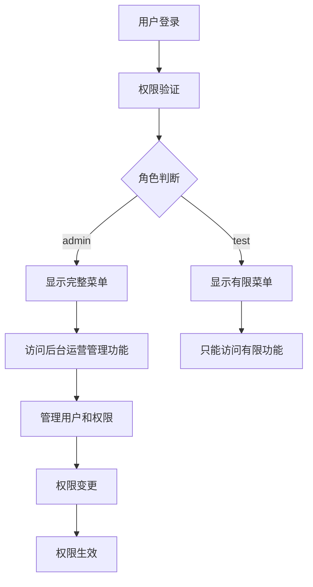

# 需求共识文档 - 权限管理功能

## 明确的业务目标与需求描述
### 业务目标
1. **实现权限管理系统**：为SAAS平台提供完善的权限管理功能，支持多用户、多角色的访问控制
2. **确保系统安全**：通过细粒度的权限控制，确保系统的安全性和数据的完整性
3. **提升管理效率**：为管理员提供便捷的权限管理工具，提高运营管理效率
4. **为SAAS平台奠定基础**：构建可扩展的权限管理体系，为后续SAAS平台的功能扩展做准备

### 需求描述
1. **基于角色的权限控制系统**：
   - 实现RBAC（基于角色的访问控制）模型
   - 支持两种角色：admin（管理员）和test（测试用户）
   - 为不同角色配置不同的权限

2. **权限配置**：
   - admin角色：拥有完整的后台运营管理权限，包括用户管理、作品管理、简历管理等所有功能
   - test角色：只能访问作品展示和简历查看等有限功能，无法访问后台运营管理功能

3. **数据库设计**：
   - 新增权限相关的数据库表
   - 为现有用户表添加必要的字段
   - 创建按日期命名的SQL脚本文件
   - 提供包含模拟数据的初始化脚本

4. **功能实现**：
   - 后端：实现权限验证和控制逻辑
   - 前端：根据用户角色显示不同的功能菜单
   - 权限变更的实时生效机制

5. **测试要求**：
   - 验证admin角色可正常访问和操作所有后台权限管理功能
   - 验证test角色无法访问和操作后台权限管理功能
   - 测试权限变更的实时生效性和数据一致性

## 用户场景与核心流程
### 用户场景
1. **管理员场景**：
   - 登录系统
   - 访问所有后台运营管理功能
   - 管理用户和权限

2. **测试用户场景**：
   - 登录系统
   - 只能访问有限的功能
   - 无法访问后台运营管理功能

### 核心流程

## 可量化的验收标准
1. **功能验收**：
   - admin角色可访问所有后台运营管理功能
   - test角色无法访问后台运营管理功能
   - 权限变更后，用户重新登录后权限生效

2. **性能验收**：
   - 权限验证响应时间≤100ms
   - 系统登录时间≤2秒

3. **安全性验收**：
   - 权限控制严格，未授权用户无法访问受限功能
   - 防止权限绕过攻击

4. **数据验收**：
   - 权限数据与用户数据一致
   - 模拟数据覆盖不同角色、权限组合的典型场景

## 产品与技术实现方案框架
### 产品方案
- **后台管理界面**：
  - 用户管理模块：管理用户信息和角色
  - 权限管理模块：配置角色权限
  - 系统设置模块：系统相关配置

- **前端界面**：
  - 根据用户角色动态显示菜单
  - 权限不足时显示友好提示

### 技术方案
- **后端**：
  - 扩展现有权限控制逻辑
  - 实现基于角色的权限验证
  - 新增权限管理相关接口

- **前端**：
  - 根据用户角色动态渲染菜单
  - 实现权限验证和提示

- **数据库**：
  - 新增权限相关表
  - 为现有表添加必要字段
  - 创建按日期命名的SQL脚本

## 技术与业务约束
1. **技术约束**：
   - 基于现有系统架构进行扩展
   - 保持与现有系统的兼容性
   - 确保权限控制的安全性和可靠性

2. **业务约束**：
   - 仅支持两种角色：admin和test
   - 权限变更需要用户重新登录才能生效
   - 不修改现有系统的核心功能

## 任务边界限制
- **功能边界**：仅实现基于角色的权限控制系统，不实现复杂的权限层级结构
- **技术边界**：基于现有技术栈进行扩展，不引入新的框架或库
- **时间边界**：按照6A流程执行，确保文档先行

## 关键假设与确认记录
| 序号 | 关键假设 | 确认状态 | 依据 |
|------|----------|----------|------|
| 1 | 权限变更后需要用户重新登录才能生效 | 已确认 | 基于现有系统的用户信息存储机制 |
| 2 | 仅支持两种角色：admin和test | 已确认 | 需求中明确指定了两种角色 |
| 3 | 后台运营管理功能包括用户管理、作品管理、简历管理等 | 已确认 | 基于现有系统的功能模块 |

## 需求变更管控规则
1. **变更流程**：任何需求变更必须通过文档更新并重新审批
2. **变更记录**：所有变更必须记录在修改历史文档中
3. **变更影响**：变更前必须评估对现有功能的影响
4. **变更通知**：变更必须通知所有相关人员