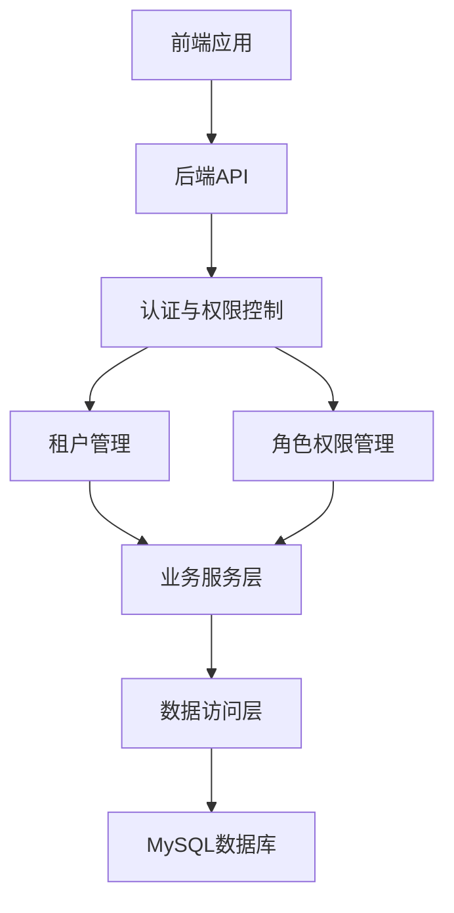
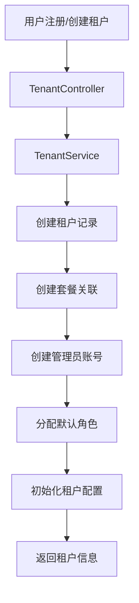
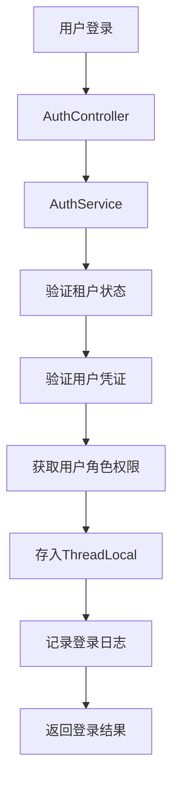
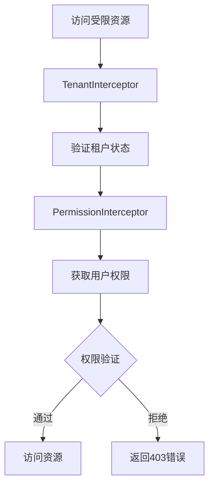

# 多租户SaaS平台权限管理系统设计规范

## 1. 多租户架构基础设计（SaaS平台核心前提）

### 1.1 租户类型定义与权限边界
系统需支持以下三类租户类型，每种类型具有明确的权限管控边界：

- **个人租户**：由个人用户注册时系统自动创建，仅限单用户使用，不具备团队管理功能及多用户协作能力。
- **团队租户**：通过付费方式创建，支持多成员协作、多角色分配及多项目管理功能，适用于中小型团队使用场景。
- **企业租户**：面向中大型企业与集团客户，提供高级付费版本或私有化部署方案，支持五级分级管控体系、自定义角色配置及合规审计功能。

### 1.2 租户隔离规则
- **数据隔离**：所有业务数据表必须包含tenant_id租户唯一标识字段，系统默认通过tenant_id实现数据逻辑隔离，确保不同租户数据严格分离。
- **权限隔离**：
  - 超级平台管理员仅具备平台基础配置管理权限，严格禁止访问任何租户的业务数据。
  - 租户超级管理员拥有本租户内的最高权限，可管理租户内所有账号、角色配置及业务数据。

### 1.3 租户生命周期管理
系统需实现完整的租户生命周期管理功能，包括：租户创建、套餐配置、状态启用/停用、到期预警、数据归档及注销等全流程管控。

## 2. 核心权限模型设计

采用多租户+RBAC（基于角色的访问控制）+四级权限管控体系的复合权限模型，具体设计如下：

- **租户隔离**：租户作为最高级别的隔离单元，确保不同租户间数据与配置完全隔离。
- **RBAC基础模型**：租户内部通过"用户-角色-权限"的映射关系实现权限管控，支持一个用户绑定多个角色，一个角色绑定多个权限项。
- **四级权限管控体系**：覆盖全平台所有业务场景，具体包括：
  1. 功能权限：控制用户可访问的系统功能模块
  2. 数据权限：控制用户可查看和操作的数据范围
  3. 操作权限：控制用户可执行的具体操作（如增删改查）
  4. 资源权限：控制用户可使用的系统资源额度与范围

## 3. 功能模块详细设计

### 3.1 多租户生命周期管理模块

#### 3.1.1 租户创建功能
- 个人租户：支持个人用户通过自助注册流程自动创建，系统自动分配基础资源与默认配置。
- 团队/企业租户：支持通过付费流程创建，需填写企业基本信息、管理员账号信息，系统自动完成租户空间初始化与默认角色配置。

#### 3.1.2 租户套餐管理
- 实现租户与付费套餐的绑定机制，自动匹配套餐对应的权限边界、用户数量上限及功能使用限制。
- 实现套餐到期自动预警功能，对超额使用功能进行自动限制或停用。

#### 3.1.3 租户状态管理
- 支持租户状态的全生命周期管理：启用/停用/归档/注销。
- 状态规则：租户停用后，租户内所有账号无法登录系统，但数据予以保留；租户注销后，数据按预设规则进行清除或归档处理。

#### 3.1.4 租户信息管理
- 支持租户基础信息编辑功能，包括企业名称、联系方式等。
- 提供租户个性化配置功能：logo上传与配置、企业域名绑定、自定义密码规则、登录安全规则及审批流程规则配置。

#### 3.1.5 租户数据管理
- 为企业租户提供数据备份、导出及迁移功能。
- 对私有化部署的租户，支持全量数据本地化存储方案。

### 3.2 用户与团队成员管理模块

#### 3.2.1 账号管理
- 实现完整的账号生命周期管理：注册、手机号/邮箱验证、密码找回、账号启用/禁用/锁定及密码重置功能。

#### 3.2.2 成员邀请功能
- 支持通过链接、邮箱或手机号多种方式邀请成员加入租户。
- 邀请时可直接为被邀请成员分配角色并设置邀请有效期，支持邀请链接的一键撤回功能。

#### 3.2.3 用户角色分配
- 支持单个或批量用户的角色分配功能，允许为用户同时分配一个或多个角色。
- 多角色权限采用权限并集原则，支持设置角色生效与失效时间。

#### 3.2.4 成员信息管理
- 支持成员基础信息编辑、部门/产品线归属配置、岗位设置及联系方式管理功能。

#### 3.2.5 组织架构管理（企业版专属）
- 支持搭建"集团-事业部-部门-项目组"的多级组织架构。
- 实现组织架构与角色权限、数据权限的绑定机制。

#### 3.2.6 账号安全管理
- 提供账号登录设备管理功能，支持查看和管理当前登录设备。
- 实现异地登录预警机制，提供详细的登录日志查询功能。
- 支持账号锁定与解锁的手动操作功能。

## 4. 技术架构设计

### 4.1 整体架构图


### 4.2 系统分层设计与核心组件定义

#### 4.2.1 后端分层
1. **API层**：处理HTTP请求，参数验证，响应格式化
   - 控制器：AuthController, TenantController, UserController, RoleController, PermissionController
   - 拦截器：LoginInterceptor, TenantInterceptor, PermissionInterceptor

2. **Service层**：业务逻辑处理
   - 服务：AuthService, TenantService, UserService, RoleService, PermissionService

3. **Repository层**：数据访问
   - 仓库：TenantRepository, UserRepository, RoleRepository, PermissionRepository, UserRoleRepository, RolePermissionRepository

4. **Model层**：数据模型
   - 实体：Tenant, SysUser, Role, Permission, UserRole, RolePermission

5. **Common层**：通用组件
   - 工具类：ThreadLocalUtil, TenantUtil, PermissionUtil
   - 配置：CorsConfig, WebMvcConfig, SecurityConfig

#### 4.2.2 前端组件
1. **页面**：
   - LoginPage：登录页
   - TenantAdminPage：租户管理页
   - UserManagementPage：用户管理页
   - RoleManagementPage：角色管理页
   - PermissionManagementPage：权限管理页
   - OrganizationPage：组织架构管理页（企业版）

2. **组件**：
   - Header：头部导航组件（根据角色动态显示菜单）
   - TenantModal：租户管理弹窗
   - UserModal：用户管理弹窗
   - RoleModal：角色管理弹窗
   - PermissionModal：权限管理弹窗
   - OrganizationTree：组织架构树组件

## 5. 数据库表结构设计

### 5.1 租户表（tenant）
| 字段名 | 数据类型 | 约束 | 描述 |
| :--- | :--- | :--- | :--- |
| `id` | `BIGINT` | `PRIMARY KEY AUTO_INCREMENT` | 租户ID |
| `tenant_name` | `VARCHAR(100)` | `NOT NULL UNIQUE` | 租户名称 |
| `tenant_type` | `VARCHAR(20)` | `NOT NULL` | 租户类型（personal/team/enterprise） |
| `status` | `VARCHAR(20)` | `NOT NULL` | 租户状态（active/inactive/archived/deleted） |
| `package_id` | `BIGINT` | `REFERENCES tenant_package(id)` | 套餐ID |
| `expire_time` | `DATETIME` | | 到期时间 |
| `created_at` | `DATETIME` | `NOT NULL DEFAULT CURRENT_TIMESTAMP` | 创建时间 |
| `updated_at` | `DATETIME` | `NOT NULL DEFAULT CURRENT_TIMESTAMP ON UPDATE CURRENT_TIMESTAMP` | 更新时间 |

### 5.2 租户套餐表（tenant_package）
| 字段名 | 数据类型 | 约束 | 描述 |
| :--- | :--- | :--- | :--- |
| `id` | `BIGINT` | `PRIMARY KEY AUTO_INCREMENT` | 套餐ID |
| `package_name` | `VARCHAR(50)` | `NOT NULL UNIQUE` | 套餐名称 |
| `user_limit` | `INT` | `NOT NULL` | 用户数量上限 |
| `feature_limit` | `JSON` | | 功能限制 |
| `price` | `DECIMAL(10,2)` | `NOT NULL` | 价格 |
| `created_at` | `DATETIME` | `NOT NULL DEFAULT CURRENT_TIMESTAMP` | 创建时间 |
| `updated_at` | `DATETIME` | `NOT NULL DEFAULT CURRENT_TIMESTAMP ON UPDATE CURRENT_TIMESTAMP` | 更新时间 |

### 5.3 用户表（sys_user）- 扩展字段
| 字段名 | 数据类型 | 约束 | 描述 |
| :--- | :--- | :--- | :--- |
| `tenant_id` | `BIGINT` | `NOT NULL REFERENCES tenant(id)` | 租户ID |
| `is_admin` | `BOOLEAN` | `NOT NULL DEFAULT FALSE` | 是否为租户管理员 |
| `status` | `VARCHAR(20)` | `NOT NULL DEFAULT 'active'` | 用户状态 |
| `last_login_time` | `DATETIME` | | 最后登录时间 |
| `last_login_ip` | `VARCHAR(50)` | | 最后登录IP |

### 5.4 角色表（role）
| 字段名 | 数据类型 | 约束 | 描述 |
| :--- | :--- | :--- | :--- |
| `id` | `BIGINT` | `PRIMARY KEY AUTO_INCREMENT` | 角色ID |
| `tenant_id` | `BIGINT` | `REFERENCES tenant(id)` | 租户ID（平台角色为NULL） |
| `role_name` | `VARCHAR(50)` | `NOT NULL` | 角色名称 |
| `description` | `VARCHAR(255)` | | 角色描述 |
| `is_system` | `BOOLEAN` | `NOT NULL DEFAULT FALSE` | 是否为系统角色 |
| `created_at` | `DATETIME` | `NOT NULL DEFAULT CURRENT_TIMESTAMP` | 创建时间 |
| `updated_at` | `DATETIME` | `NOT NULL DEFAULT CURRENT_TIMESTAMP ON UPDATE CURRENT_TIMESTAMP` | 更新时间 |

### 5.5 权限表（permission）
| 字段名 | 数据类型 | 约束 | 描述 |
| :--- | :--- | :--- | :--- |
| `id` | `BIGINT` | `PRIMARY KEY AUTO_INCREMENT` | 权限ID |
| `permission_code` | `VARCHAR(50)` | `NOT NULL UNIQUE` | 权限编码 |
| `permission_name` | `VARCHAR(100)` | `NOT NULL` | 权限名称 |
| `description` | `VARCHAR(255)` | | 权限描述 |
| `permission_type` | `VARCHAR(20)` | `NOT NULL` | 权限类型（function/data/operation/resource） |
| `created_at` | `DATETIME` | `NOT NULL DEFAULT CURRENT_TIMESTAMP` | 创建时间 |
| `updated_at` | `DATETIME` | `NOT NULL DEFAULT CURRENT_TIMESTAMP ON UPDATE CURRENT_TIMESTAMP` | 更新时间 |

### 5.6 用户角色关联表（user_role）
| 字段名 | 数据类型 | 约束 | 描述 |
| :--- | :--- | :--- | :--- |
| `id` | `BIGINT` | `PRIMARY KEY AUTO_INCREMENT` | 关联ID |
| `user_id` | `BIGINT` | `NOT NULL REFERENCES sys_user(id)` | 用户ID |
| `role_id` | `BIGINT` | `NOT NULL REFERENCES role(id)` | 角色ID |
| `effective_time` | `DATETIME` | | 生效时间 |
| `expire_time` | `DATETIME` | | 失效时间 |
| `created_at` | `DATETIME` | `NOT NULL DEFAULT CURRENT_TIMESTAMP` | 创建时间 |

### 5.7 角色权限关联表（role_permission）
| 字段名 | 数据类型 | 约束 | 描述 |
| :--- | :--- | :--- | :--- |
| `id` | `BIGINT` | `PRIMARY KEY AUTO_INCREMENT` | 关联ID |
| `role_id` | `BIGINT` | `NOT NULL REFERENCES role(id)` | 角色ID |
| `permission_id` | `BIGINT` | `NOT NULL REFERENCES permission(id)` | 权限ID |
| `created_at` | `DATETIME` | `NOT NULL DEFAULT CURRENT_TIMESTAMP` | 创建时间 |

### 5.8 组织架构表（organization）
| 字段名 | 数据类型 | 约束 | 描述 |
| :--- | :--- | :--- | :--- |
| `id` | `BIGINT` | `PRIMARY KEY AUTO_INCREMENT` | 组织ID |
| `tenant_id` | `BIGINT` | `NOT NULL REFERENCES tenant(id)` | 租户ID |
| `parent_id` | `BIGINT` | `REFERENCES organization(id)` | 父组织ID |
| `org_name` | `VARCHAR(100)` | `NOT NULL` | 组织名称 |
| `org_type` | `VARCHAR(20)` | `NOT NULL` | 组织类型（group/department/project） |
| `created_at` | `DATETIME` | `NOT NULL DEFAULT CURRENT_TIMESTAMP` | 创建时间 |
| `updated_at` | `DATETIME` | `NOT NULL DEFAULT CURRENT_TIMESTAMP ON UPDATE CURRENT_TIMESTAMP` | 更新时间 |

### 5.9 用户组织关联表（user_organization）
| 字段名 | 数据类型 | 约束 | 描述 |
| :--- | :--- | :--- | :--- |
| `id` | `BIGINT` | `PRIMARY KEY AUTO_INCREMENT` | 关联ID |
| `user_id` | `BIGINT` | `NOT NULL REFERENCES sys_user(id)` | 用户ID |
| `org_id` | `BIGINT` | `NOT NULL REFERENCES organization(id)` | 组织ID |
| `position` | `VARCHAR(50)` | | 职位 |
| `created_at` | `DATETIME` | `NOT NULL DEFAULT CURRENT_TIMESTAMP` | 创建时间 |

### 5.10 登录日志表（login_log）
| 字段名 | 数据类型 | 约束 | 描述 |
| :--- | :--- | :--- | :--- |
| `id` | `BIGINT` | `PRIMARY KEY AUTO_INCREMENT` | 日志ID |
| `user_id` | `BIGINT` | `REFERENCES sys_user(id)` | 用户ID |
| `tenant_id` | `BIGINT` | `REFERENCES tenant(id)` | 租户ID |
| `login_time` | `DATETIME` | `NOT NULL DEFAULT CURRENT_TIMESTAMP` | 登录时间 |
| `login_ip` | `VARCHAR(50)` | `NOT NULL` | 登录IP |
| `login_device` | `VARCHAR(100)` | | 登录设备 |
| `login_result` | `VARCHAR(20)` | `NOT NULL` | 登录结果（success/fail） |
| `fail_reason` | `VARCHAR(255)` | | 失败原因 |

## 6. 接口契约完整定义

### 6.1 租户管理接口
- **接口**：`POST /api/tenant/create`
- **描述**：创建租户
- **请求参数**：
  ```json
  {
    "tenantName": "测试租户",
    "tenantType": "team",
    "packageId": 1,
    "adminUsername": "admin",
    "adminEmail": "admin@example.com",
    "adminPassword": "password123"
  }
  ```
- **响应**：
  ```json
  {
    "code": 200,
    "message": "租户创建成功",
    "data": {
      "tenantId": 1,
      "tenantName": "测试租户",
      "adminUserId": 1
    }
  }
  ```

- **接口**：`GET /api/tenant/list`
- **描述**：获取租户列表（平台管理员）
- **响应**：
  ```json
  {
    "code": 200,
    "message": "成功",
    "data": [
      {
        "id": 1,
        "tenantName": "测试租户",
        "tenantType": "team",
        "status": "active",
        "expireTime": "2024-12-31T23:59:59",
        "createdAt": "2024-01-01T00:00:00"
      }
    ]
  }
  ```

### 6.2 用户管理接口
- **接口**：`POST /api/user/invite`
- **描述**：邀请用户
- **请求参数**：
  ```json
  {
    "email": "user@example.com",
    "roleIds": [2, 3],
    "expireTime": "2024-12-31T23:59:59"
  }
  ```
- **响应**：
  ```json
  {
    "code": 200,
    "message": "邀请发送成功",
    "data": {
      "inviteLink": "http://example.com/invite?token=xxx"
    }
  }
  ```

- **接口**：`PUT /api/user/{id}/roles`
- **描述**：分配用户角色
- **请求参数**：
  ```json
  {
    "roleIds": [2, 3],
    "effectiveTime": "2024-01-01T00:00:00",
    "expireTime": "2024-12-31T23:59:59"
  }
  ```
- **响应**：
  ```json
  {
    "code": 200,
    "message": "角色分配成功",
    "data": null
  }
  ```

### 6.3 角色管理接口
- **接口**：`POST /api/role/create`
- **描述**：创建角色
- **请求参数**：
  ```json
  {
    "roleName": "编辑",
    "description": "具有编辑权限的角色",
    "permissionIds": [1, 2, 3]
  }
  ```
- **响应**：
  ```json
  {
    "code": 200,
    "message": "角色创建成功",
    "data": {
      "roleId": 3,
      "roleName": "编辑"
    }
  }
  ```

- **接口**：`PUT /api/role/{id}/permissions`
- **描述**：更新角色权限
- **请求参数**：
  ```json
  {
    "permissionIds": [1, 2, 3, 4]
  }
  ```
- **响应**：
  ```json
  {
    "code": 200,
    "message": "权限更新成功",
    "data": null
  }
  ```

### 6.4 组织架构接口
- **接口**：`POST /api/organization/create`
- **描述**：创建组织
- **请求参数**：
  ```json
  {
    "orgName": "技术部",
    "orgType": "department",
    "parentId": 1
  }
  ```
- **响应**：
  ```json
  {
    "code": 200,
    "message": "组织创建成功",
    "data": {
      "orgId": 2,
      "orgName": "技术部"
    }
  }
  ```

- **接口**：`GET /api/organization/tree`
- **描述**：获取组织架构树
- **响应**：
  ```json
  {
    "code": 200,
    "message": "成功",
    "data": {
      "id": 1,
      "orgName": "公司",
      "orgType": "group",
      "children": [
        {
          "id": 2,
          "orgName": "技术部",
          "orgType": "department",
          "children": []
        }
      ]
    }
  }
  ```

## 7. 核心业务数据流向图

### 7.1 租户创建流程


### 7.2 用户登录流程


### 7.3 权限验证流程


## 8. 安全设计与合规适配方案

### 8.1 安全设计
- **租户隔离**：通过tenant_id字段实现数据逻辑隔离
- **权限验证**：基于角色的权限控制，结合租户上下文
- **防止权限绕过**：在拦截器中进行权限验证，确保所有请求都经过权限检查
- **SQL注入防护**：使用Spring Data JPA的参数化查询
- **XSS防护**：前端输入验证，后端输出编码
- **密码安全**：使用bcrypt等安全哈希算法存储密码
- **Token管理**：使用JWT，设置合理的过期时间
- **API安全**：实现API访问频率限制，防止暴力攻击

### 8.2 合规适配方案
- **数据隐私**：遵守GDPR、CCPA等数据隐私法规
- **审计日志**：记录所有权限变更和敏感操作
- **访问控制**：实现最小权限原则
- **数据备份**：定期备份租户数据
- **数据销毁**：租户注销后按规定时间销毁数据

## 9. 性能优化方案

### 9.1 数据库优化
- **索引优化**：为常用查询字段添加索引，特别是tenant_id、user_id等
- **分区表**：对于大型租户，考虑使用分区表提高查询性能
- **缓存策略**：缓存租户配置、角色权限等频繁访问的数据

### 9.2 应用优化
- **批量操作**：支持批量用户角色分配、批量权限更新等操作
- **异步处理**：对于耗时操作，如租户创建、数据导出等，使用异步处理
- **连接池**：配置合理的数据库连接池大小
- **负载均衡**：支持多实例部署，实现负载均衡

### 9.3 前端优化
- **懒加载**：组件和数据的懒加载
- **缓存**：前端缓存常用数据，减少API调用
- **分页**：大数据列表使用分页加载
- **防抖节流**：优化用户输入和搜索操作

## 10. 部署与运维方案

### 10.1 部署架构
- **容器化部署**：使用Docker容器化部署
- **微服务架构**：将租户管理、用户管理、权限管理等拆分为微服务
- **CI/CD**：实现持续集成和持续部署

### 10.2 监控与告警
- **系统监控**：监控服务运行状态、CPU、内存、磁盘等
- **应用监控**：监控API响应时间、错误率等
- **业务监控**：监控租户活跃度、用户增长等
- **告警机制**：设置合理的告警阈值，及时发现和处理问题

### 10.3 灾备方案
- **数据备份**：定期备份数据库和配置文件
- **灾难恢复**：制定详细的灾难恢复计划
- **高可用性**：实现多可用区部署，确保服务高可用

## 11. 结论与建议

### 11.1 结论
本设计规范基于多租户+RBAC+四级权限管控体系的复合权限模型，实现了完整的SaaS平台权限管理功能。通过租户隔离、角色管理、权限控制等机制，确保了系统的安全性、可扩展性和可维护性。

### 11.2 建议
1. **逐步实施**：建议采用增量开发策略，先实现核心功能，再逐步扩展高级功能
2. **测试覆盖**：加强单元测试和集成测试，确保权限控制的准确性和安全性
3. **用户反馈**：持续收集用户反馈，优化权限管理流程和用户体验
4. **安全审计**：定期进行安全审计，发现和修复潜在的安全漏洞
5. **文档完善**：完善API文档和使用手册，方便开发和运维人员使用

### 11.3 未来扩展
1. **多因素认证**：支持短信验证码、邮件验证码等多因素认证
2. **单点登录**：集成OAuth2.0、SAML等单点登录协议
3. **权限模板**：提供预设的权限模板，方便快速配置
4. **自定义权限**：支持租户自定义权限项
5. **权限分析**：提供权限使用情况分析和优化建议

本设计规范为多租户SaaS平台的权限管理系统提供了完整的技术方案，可根据实际业务需求进行调整和扩展。