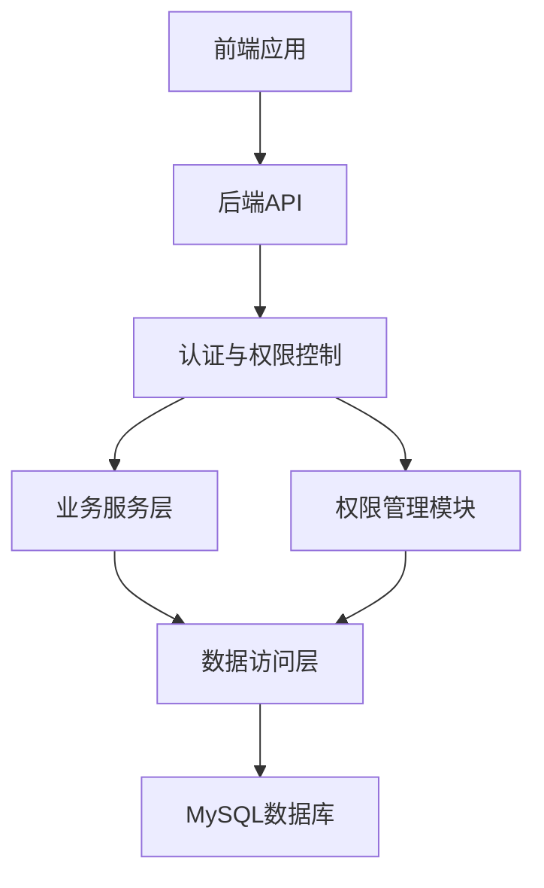
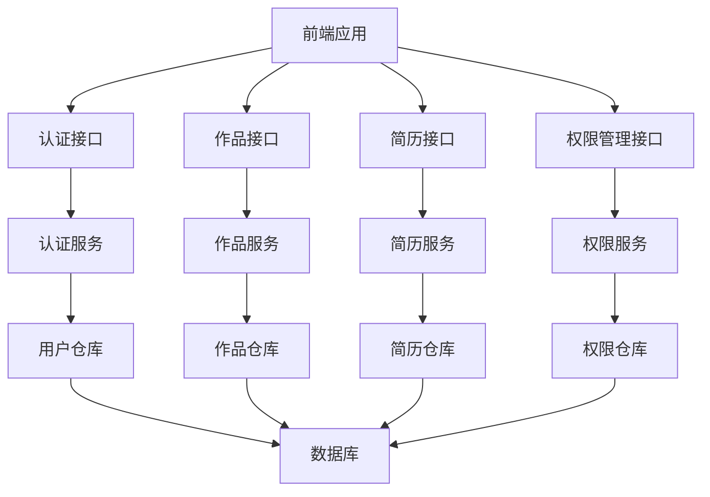
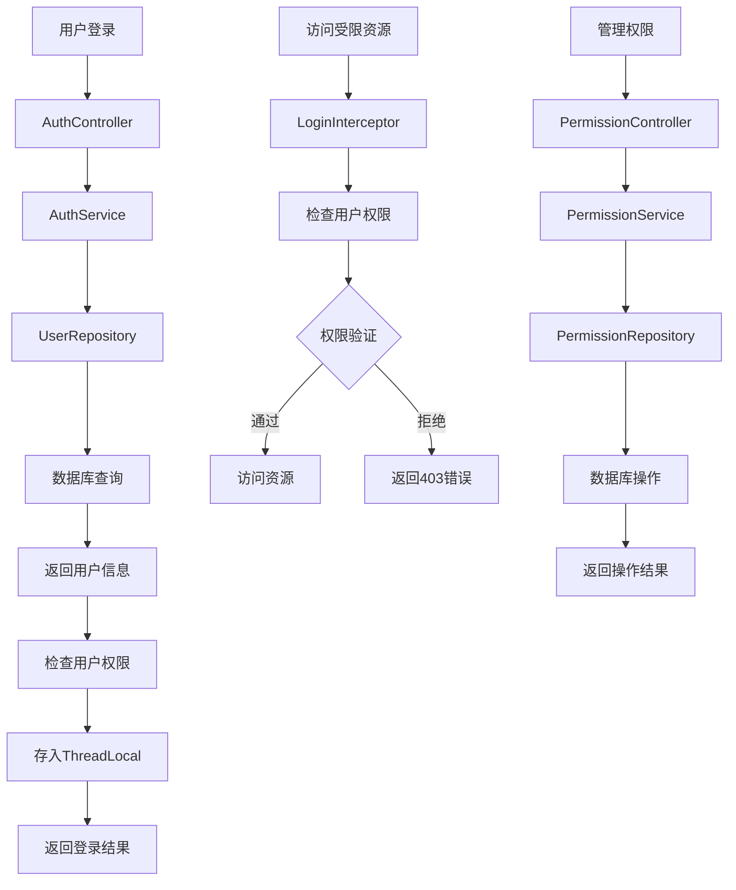

# 技术架构设计文档 - 权限管理功能

## 整体架构图


## 系统分层设计与核心组件定义
### 后端分层
1. **API层**：处理HTTP请求，参数验证，响应格式化
   - 控制器：AuthController, ProjectController, ResumeController, UploadController, PermissionController
   - 拦截器：LoginInterceptor（权限控制）

2. **Service层**：业务逻辑处理
   - 服务：AuthService, ProjectService, ResumeService, UploadService, PermissionService

3. **Repository层**：数据访问
   - 仓库：UserRepository, ProjectRepository, ResumeRepository, PermissionRepository

4. **Model层**：数据模型
   - 实体：SysUser, PmProject, PmResume, SysRole, SysPermission, SysRolePermission

5. **Common层**：通用组件
   - 工具类：ThreadLocalUtil, PermissionUtil
   - 配置：CorsConfig, WebMvcConfig

### 前端组件
1. **页面**：
   - LoginPage：登录页
   - ProjectPage：作品展示页
   - ResumePage：简历管理页
   - AdminPage：后台管理页

2. **组件**：
   - Header：头部导航组件（根据角色动态显示菜单）
   - PermissionModal：权限管理弹窗
   - UserManagement：用户管理组件

## 模块依赖关系图


## 接口契约完整定义
### 1. 权限管理接口
- **接口**：`GET /api/permission/roles`
- **描述**：获取角色列表
- **响应**：
  ```json
  {
    "code": 200,
    "message": "成功",
    "data": [
      {
        "id": 1,
        "name": "admin",
        "description": "管理员角色"
      },
      {
        "id": 2,
        "name": "test",
        "description": "测试用户角色"
      }
    ]
  }
  ```

- **接口**：`GET /api/permission/permissions`
- **描述**：获取权限列表
- **响应**：
  ```json
  {
    "code": 200,
    "message": "成功",
    "data": [
      {
        "id": 1,
        "name": "USER_MANAGE",
        "description": "用户管理权限"
      },
      {
        "id": 2,
        "name": "PROJECT_MANAGE",
        "description": "作品管理权限"
      },
      {
        "id": 3,
        "name": "RESUME_MANAGE",
        "description": "简历管理权限"
      }
    ]
  }
  ```

- **接口**：`GET /api/permission/role-permissions/{roleId}`
- **描述**：获取角色权限
- **响应**：
  ```json
  {
    "code": 200,
    "message": "成功",
    "data": [
      {
        "permissionId": 1,
        "permissionName": "USER_MANAGE",
        "description": "用户管理权限"
      },
      {
        "permissionId": 2,
        "permissionName": "PROJECT_MANAGE",
        "description": "作品管理权限"
      }
    ]
  }
  ```

- **接口**：`POST /api/permission/role-permissions`
- **描述**：设置角色权限
- **请求参数**：
  ```json
  {
    "roleId": 1,
    "permissionIds": [1, 2, 3]
  }
  ```
- **响应**：
  ```json
  {
    "code": 200,
    "message": "设置成功",
    "data": null
  }
  ```

### 2. 用户管理接口
- **接口**：`GET /api/users`
- **描述**：获取用户列表
- **响应**：
  ```json
  {
    "code": 200,
    "message": "成功",
    "data": [
      {
        "id": 1,
        "username": "admin",
        "role": "admin",
        "roleId": 1
      },
      {
        "id": 2,
        "username": "test",
        "role": "test",
        "roleId": 2
      }
    ]
  }
  ```

- **接口**：`PUT /api/users/{id}/role`
- **描述**：修改用户角色
- **请求参数**：
  ```json
  {
    "roleId": 2
  }
  ```
- **响应**：
  ```json
  {
    "code": 200,
    "message": "修改成功",
    "data": null
  }
  ```

## 核心业务数据流向图


## 数据库表结构设计
### 1. sys_role（角色表）
| 字段名 | 数据类型 | 约束 | 描述 |
| :--- | :--- | :--- | :--- |
| `id` | `BIGINT` | `PRIMARY KEY AUTO_INCREMENT` | 角色ID |
| `name` | `VARCHAR(50)` | `NOT NULL UNIQUE` | 角色名称 |
| `description` | `VARCHAR(255)` | | 角色描述 |
| `created_at` | `DATETIME` | `NOT NULL DEFAULT CURRENT_TIMESTAMP` | 创建时间 |
| `updated_at` | `DATETIME` | `NOT NULL DEFAULT CURRENT_TIMESTAMP ON UPDATE CURRENT_TIMESTAMP` | 更新时间 |

**索引**：
- 主键索引：`id`
- 唯一索引：`name`

### 2. sys_permission（权限表）
| 字段名 | 数据类型 | 约束 | 描述 |
| :--- | :--- | :--- | :--- |
| `id` | `BIGINT` | `PRIMARY KEY AUTO_INCREMENT` | 权限ID |
| `name` | `VARCHAR(50)` | `NOT NULL UNIQUE` | 权限名称 |
| `description` | `VARCHAR(255)` | | 权限描述 |
| `created_at` | `DATETIME` | `NOT NULL DEFAULT CURRENT_TIMESTAMP` | 创建时间 |
| `updated_at` | `DATETIME` | `NOT NULL DEFAULT CURRENT_TIMESTAMP ON UPDATE CURRENT_TIMESTAMP` | 更新时间 |

**索引**：
- 主键索引：`id`
- 唯一索引：`name`

### 3. sys_role_permission（角色权限关联表）
| 字段名 | 数据类型 | 约束 | 描述 |
| :--- | :--- | :--- | :--- |
| `id` | `BIGINT` | `PRIMARY KEY AUTO_INCREMENT` | 关联ID |
| `role_id` | `BIGINT` | `NOT NULL REFERENCES sys_role(id)` | 角色ID |
| `permission_id` | `BIGINT` | `NOT NULL REFERENCES sys_permission(id)` | 权限ID |
| `created_at` | `DATETIME` | `NOT NULL DEFAULT CURRENT_TIMESTAMP` | 创建时间 |

**索引**：
- 主键索引：`id`
- 联合唯一索引：`(role_id, permission_id)`

### 4. sys_user（用户表）- 扩展字段
| 字段名 | 数据类型 | 约束 | 描述 |
| :--- | :--- | :--- | :--- |
| `role_id` | `BIGINT` | `REFERENCES sys_role(id)` | 角色ID |

**索引**：
- 普通索引：`role_id`

## 全局异常处理策略
- **统一异常处理**：使用`@ControllerAdvice`捕获全局异常
- **错误码定义**：
  - 200：成功
  - 400：请求参数错误
  - 401：未授权
  - 403：权限不足
  - 500：服务器内部错误

## 安全设计与合规适配方案
- **权限验证**：基于角色的权限控制
- **防止权限绕过**：在拦截器中进行权限验证
- **SQL注入防护**：使用Spring Data JPA的参数化查询
- **XSS防护**：前端输入验证

## 性能优化方案
- **数据库索引**：为常用查询字段添加索引
- **缓存策略**：缓存权限信息，减少数据库查询
- **批量操作**：支持批量权限分配

## 权限控制流程
1. **用户登录**：验证用户名和密码，获取用户角色和权限信息
2. **权限验证**：访问受限资源时，检查用户是否具有相应权限
3. **权限管理**：管理员可以管理用户角色和权限
4. **权限生效**：权限变更后，用户需要重新登录才能生效