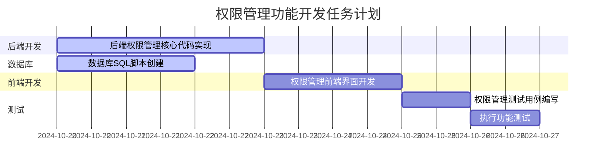

# 权限管理功能原子任务拆分文档

## 1. 任务基础信息

- **任务名称**：权限管理功能开发
- **任务描述**：实现基于角色的权限控制系统，区分admin和test两种角色，为admin角色配置完整的后台运营管理权限，限制test角色访问后台运营管理功能的权限
- **任务范围**：后台权限相关的运营管理功能
- **任务负责人**：AI自动执行
- **任务优先级**：高
- **预估总工时**：16人时

## 2. 原子任务拆分

### 2.1 任务1：后端权限管理核心代码实现

- **任务ID**：TASK-001
- **所属模块**：后端服务
- **负责角色**：后端开发
- **预估工时**：6人时
- **优先级**：高

**输入契约**：
- 前置依赖项：无
- 输入数据格式：无
- 环境/资源依赖要求：Spring Boot 3.2.0、Spring Data JPA、MySQL 8.0+
- 必须读取的文档清单：
  - `DESIGN_permission-management.md`
  - 项目代码规范文档

**输出契约**：
- 交付物清单：
  - 权限管理相关实体类（Role、Permission、UserRole等）
  - 权限管理相关Repository接口
  - 权限管理相关Service实现
  - 权限管理相关Controller接口
  - 权限验证拦截器/注解
- 输出数据格式：Java代码
- 可量化的验收标准：
  - 实现基于角色的权限控制
  - 区分admin和test角色
  - admin角色拥有完整权限
  - test角色权限受限
- 必须同步更新的文档清单：
  - `MODIFICATION_HISTORY_backend.md`

**实现约束**：
- 严格遵循项目代码规范
- 优先使用项目现有工具和库
- 代码必须精简、高可读、低复杂度
- 所有接口必须做权限校验、参数校验

**依赖关系**：
- 前置依赖任务：无
- 可并行任务：任务2（SQL脚本创建）
- 后置关联任务：任务4（前端开发）

### 2.2 任务2：数据库SQL脚本创建

- **任务ID**：TASK-002
- **所属模块**：数据库
- **负责角色**：后端开发
- **预估工时**：4人时
- **优先级**：高

**输入契约**：
- 前置依赖项：无
- 输入数据格式：无
- 环境/资源依赖要求：MySQL 8.0+
- 必须读取的文档清单：
  - `DESIGN_permission-management.md`
  - 数据库设计规范文档

**输出契约**：
- 交付物清单：
  - 按日期命名的SQL脚本文件（包含表结构创建）
  - 包含模拟数据的初始化脚本
- 输出数据格式：SQL文件
- 可量化的验收标准：
  - SQL文件以日期命名，格式为YYYYMMDD_功能描述.sql
  - 包含完整的权限管理表结构
  - 包含admin和test角色的模拟数据
  - 权限分配符合业务逻辑
- 必须同步更新的文档清单：
  - `MODIFICATION_HISTORY_database.md`

**实现约束**：
- 严格遵循数据库设计规范
- 确保SQL文件版本控制清晰
- 模拟数据符合业务逻辑和数据完整性约束

**依赖关系**：
- 前置依赖任务：无
- 可并行任务：任务1（后端代码实现）
- 后置关联任务：任务6（功能测试）

### 2.3 任务3：权限管理前端界面开发

- **任务ID**：TASK-003
- **所属模块**：前端
- **负责角色**：前端开发
- **预估工时**：4人时
- **优先级**：中

**输入契约**：
- 前置依赖项：任务1（后端代码实现）
- 输入数据格式：API接口文档
- 环境/资源依赖要求：Vue 3、Element Plus
- 必须读取的文档清单：
  - `DESIGN_permission-management.md`
  - 前端代码规范文档
  - 设计系统文档

**输出契约**：
- 交付物清单：
  - 权限管理前端组件
  - 角色管理界面
  - 权限配置界面
- 输出数据格式：Vue组件
- 可量化的验收标准：
  - 界面符合设计系统规范
  - 功能完整，可正常操作
  - 权限控制效果正确显示
- 必须同步更新的文档清单：
  - `MODIFICATION_HISTORY_frontend.md`

**实现约束**：
- 严格遵循前端代码规范
- 遵循项目设计系统
- 界面响应式设计，适配不同终端

**依赖关系**：
- 前置依赖任务：任务1（后端代码实现）
- 可并行任务：无
- 后置关联任务：任务6（功能测试）

### 2.4 任务4：权限管理测试用例编写

- **任务ID**：TASK-004
- **所属模块**：测试
- **负责角色**：测试
- **预估工时**：2人时
- **优先级**：中

**输入契约**：
- 前置依赖项：任务1（后端代码实现）、任务3（前端开发）
- 输入数据格式：API接口文档、前端界面
- 环境/资源依赖要求：测试框架
- 必须读取的文档清单：
  - `DESIGN_permission-management.md`
  - 测试规范文档

**输出契约**：
- 交付物清单：
  - 权限管理功能测试用例
  - 角色权限验证测试脚本
- 输出数据格式：测试用例文档
- 可量化的验收标准：
  - 测试用例覆盖所有权限管理功能
  - 测试用例覆盖admin和test角色的权限验证
  - 测试用例覆盖权限变更的实时生效性
- 必须同步更新的文档清单：
  - `TEST_CASE_permission-management.md`

**实现约束**：
- 严格遵循测试规范
- 测试用例覆盖正常流程、边界条件、异常场景
- 测试用例可独立运行

**依赖关系**：
- 前置依赖任务：任务1（后端代码实现）、任务3（前端开发）
- 可并行任务：无
- 后置关联任务：任务6（功能测试）

## 3. 任务执行计划

### 3.1 任务依赖甘特图

### 3.2 关键路径

1. 任务1（后端权限管理核心代码实现）- 3天
2. 任务2（数据库SQL脚本创建）- 2天（与任务1并行）
3. 任务3（权限管理前端界面开发）- 2天（依赖任务1）
4. 任务4（权限管理测试用例编写）- 1天（依赖任务1和任务3）
5. 任务5（执行功能测试）- 1天（依赖任务2、任务3、任务4）

### 3.3 里程碑节点

- **里程碑1**：后端权限管理核心代码实现完成（2024-10-22）
- **里程碑2**：数据库SQL脚本创建完成（2024-10-21）
- **里程碑3**：前端权限管理界面开发完成（2024-10-24）
- **里程碑4**：测试用例编写完成（2024-10-25）
- **里程碑5**：功能测试完成（2024-10-26）

## 4. 执行前检查清单

### 4.1 完整性检查
- [x] 任务计划100%覆盖所有需求点与设计内容
- [x] 所有任务都有明确的输入输出契约
- [x] 所有任务都有可量化的验收标准

### 4.2 一致性检查
- [x] 任务计划与前期对齐、共识、设计文档完全一致
- [x] 任务依赖关系无循环、无逻辑冲突
- [x] 任务拆分符合原子化原则

### 4.3 可行性检查
- [x] 技术方案可落地、可执行
- [x] 资源匹配合理
- [x] 风险在可接受范围

### 4.4 可测性检查
- [x] 所有验收标准明确可执行
- [x] 测试用例覆盖完整
- [x] 可通过测试/走查验证

### 4.5 文档绑定检查
- [x] 每个任务都明确绑定了输入文档与输出文档
- [x] 文档更新机制明确

## 5. 风险与应对

### 5.1 风险识别
1. **技术风险**：权限管理逻辑复杂度高，可能出现权限控制不严格的情况
2. **数据风险**：模拟数据创建可能不符合业务逻辑
3. **测试风险**：权限测试覆盖不全面，可能遗漏边界场景

### 5.2 应对措施
1. **技术风险**：严格按照设计文档实现，增加权限验证的单元测试
2. **数据风险**：参考现有系统数据结构，确保模拟数据符合业务逻辑
3. **测试风险**：编写全面的测试用例，覆盖正常、边界、异常场景

## 6. 交付物清单

- 后端权限管理核心代码
- 按日期命名的SQL脚本文件
- 包含模拟数据的初始化脚本
- 权限管理前端界面
- 权限管理测试用例
- 功能测试报告
- 验收记录文档
- 最终交付报告

## 7. 审批确认

本任务计划已完成编写，待用户审批通过后执行。

**审批状态**：待审批
**审批人**：
**审批日期**：
**审批意见**：