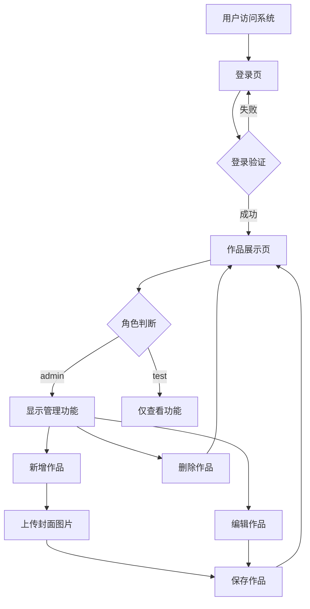

# 需求共识文档 - 产品经理个人作品展示系统

## 明确的业务目标与需求描述
### 业务目标
1. **提供个人作品展示平台**：为产品经理提供一个专业的个人作品展示系统，方便展示项目案例
2. **支持作品管理**：允许管理员对作品进行增删改查操作
3. **确保系统安全**：通过角色权限控制，确保系统安全
4. **提供良好的用户体验**：响应式设计，科技风界面，操作简单直观

### 需求描述
1. **用户认证**：
   - 实现登录功能，验证用户名和密码
   - 支持两种角色：admin（管理员）和test（测试用户）
   - 登录成功后将用户信息存入ThreadLocal

2. **作品管理**：
   - 支持作品的增删改查操作
   - 作品包含：标题、描述、封面图片、详情链接、排序字段
   - 仅admin角色可执行新增/编辑/删除操作

3. **图片上传**：
   - 提供封面图片上传接口
   - 支持jpg/png格式图片
   - 上传后返回可访问的URL

4. **前端界面**：
   - 登录页：简单的登录表单
   - 作品展示页：响应式布局，展示作品卡片
   - 新增/编辑弹窗：包含表单字段和图片上传功能
   - 根据角色显示不同的操作按钮

## 用户场景与核心流程
### 用户场景
1. **管理员场景**：
   - 登录系统
   - 查看所有作品
   - 新增作品（包括上传封面图片）
   - 编辑作品
   - 删除作品

2. **测试用户场景**：
   - 登录系统
   - 查看所有作品
   - 无法进行编辑、删除、上传操作

### 核心流程

## 可量化的验收标准
1. **功能验收**：
   - 登录功能正常，能正确验证用户名和密码
   - 角色权限控制有效，test用户无法执行管理操作
   - 作品增删改查操作正常
   - 图片上传功能正常，返回有效的URL

2. **性能验收**：
   - 页面加载时间≤2秒
   - 接口响应时间≤500ms
   - 支持至少100个作品的展示

3. **界面验收**：
   - 响应式设计，适配不同屏幕尺寸
   - 科技风界面，美观整洁
   - 操作流程清晰，用户体验良好

4. **安全性验收**：
   - 密码验证有效
   - 权限控制严格，未授权用户无法访问管理接口
   - 防止SQL注入和XSS攻击

## 产品与技术实现方案框架
### 产品方案
- **登录页**：包含用户名、密码输入框，登录按钮
- **作品展示页**：顶部导航栏，作品卡片网格，新增作品按钮（仅admin可见）
- **新增/编辑弹窗**：表单字段（标题、描述、封面上传、详情链接、排序），保存/取消按钮

### 技术方案
- **后端**：
  - Java 17+, Spring Boot 3.x, Spring Data JPA, MySQL, Lombok
  - RESTful API设计
  - ThreadLocal存储用户信息
  - CORS配置支持跨域

- **前端**：
  - Vue 3 (Composition API) + Axios + 原生 CSS
  - 响应式设计
  - 科技风界面

- **数据库**：
  - MySQL 8.0+
  - 两张表：sys_user（用户表）和pm_project（作品表）

## 技术与业务约束
1. **技术约束**：
   - 使用指定的技术栈
   - 数据库连接配置固定：8.148.235.131:3306，root/123456
   - 图片上传仅做演示，返回mock URL

2. **业务约束**：
   - 仅支持两种角色：admin和test
   - 不支持用户注册和密码重置
   - 作品详情通过外部链接访问

## 任务边界限制
- **功能边界**：仅实现指定的功能，不扩展其他功能
- **技术边界**：使用指定的技术栈，不引入其他框架或库
- **时间边界**：按照6A流程执行，确保文档先行

## 关键假设与确认记录
| 序号 | 关键假设 | 确认状态 | 依据 |
|------|----------|----------|------|
| 1 | 数据库连接配置正确 | 已确认 | 需求中明确提供了数据库配置信息 |
| 2 | 图片上传返回mock URL | 已确认 | 需求中明确说明可返回mock URL |
| 3 | 前端登录页需要实现 | 已确认 | 系统需要登录认证才能访问 |
| 4 | 仅支持两种角色 | 已确认 | 需求中明确指定了两种角色 |

## 需求变更管控规则
1. **变更流程**：任何需求变更必须通过文档更新并重新审批
2. **变更记录**：所有变更必须记录在修改历史文档中
3. **变更影响**：变更前必须评估对现有功能的影响
4. **变更通知**：变更必须通知所有相关人员