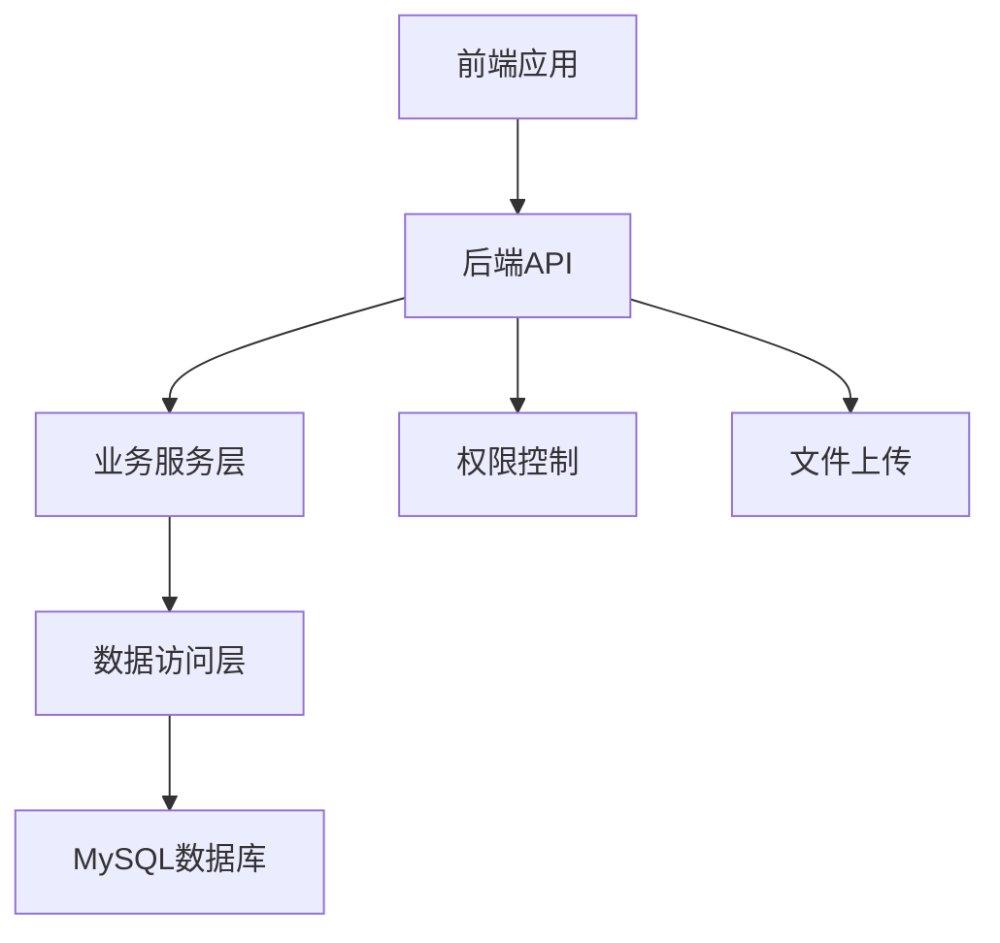
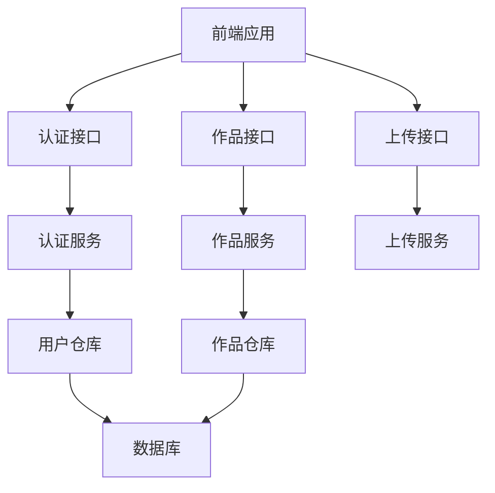
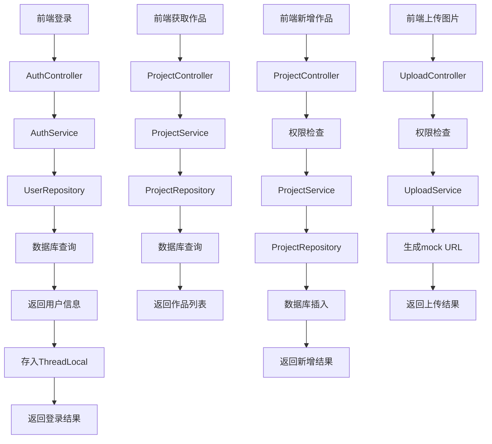

# 技术架构设计文档 - 产品经理个人作品展示系统

## 整体架构图


## 系统分层设计与核心组件定义
### 后端分层
1. **API层**：处理HTTP请求，参数验证，响应格式化
   - 控制器：AuthController, ProjectController, UploadController
   - 拦截器：LoginInterceptor（权限控制）

2. **Service层**：业务逻辑处理
   - 服务：AuthService, ProjectService, UploadService

3. **Repository层**：数据访问
   - 仓库：UserRepository, ProjectRepository

4. **Model层**：数据模型
   - 实体：SysUser, PmProject

5. **Common层**：通用组件
   - 工具类：ThreadLocalUtil
   - 配置：CorsConfig, WebMvcConfig

### 前端组件
1. **页面**：
   - LoginPage：登录页
   - ProjectPage：作品展示页

2. **组件**：
   - ProjectCard：作品卡片组件
   - ProjectModal：新增/编辑弹窗组件
   - ImageUploader：图片上传组件

## 模块依赖关系图


## 接口契约完整定义
### 1. 认证接口
- **接口**：`POST /api/auth/login`
- **描述**：用户登录
- **请求参数**：
  ```json
  {
    "username": "admin",
    "password": "admin123"
  }
  ```
- **响应**：
  ```json
  {
    "code": 200,
    "message": "登录成功",
    "data": {
      "id": 1,
      "username": "admin",
      "role": "admin"
    }
  }
  ```

### 2. 作品接口
- **接口**：`GET /api/projects`
- **描述**：获取作品列表
- **响应**：
  ```json
  {
    "code": 200,
    "message": "成功",
    "data": [
      {
        "id": 1,
        "title": "项目1",
        "description": "项目描述",
        "coverImage": "https://example.com/image.jpg",
        "detailLink": "https://example.com/project1",
        "sort": 1,
        "createdAt": "2026-03-22T00:00:00",
        "updatedAt": "2026-03-22T00:00:00"
      }
    ]
  }
  ```

- **接口**：`POST /api/projects`
- **描述**：新增作品
- **请求参数**：
  ```json
  {
    "title": "新项目",
    "description": "项目描述",
    "coverImage": "https://example.com/image.jpg",
    "detailLink": "https://example.com/new-project",
    "sort": 1
  }
  ```
- **响应**：
  ```json
  {
    "code": 200,
    "message": "新增成功",
    "data": {
      "id": 2,
      "title": "新项目",
      "description": "项目描述",
      "coverImage": "https://example.com/image.jpg",
      "detailLink": "https://example.com/new-project",
      "sort": 1,
      "createdAt": "2026-03-22T00:00:00",
      "updatedAt": "2026-03-22T00:00:00"
    }
  }
  ```

- **接口**：`PUT /api/projects/{id}`
- **描述**：编辑作品
- **请求参数**：
  ```json
  {
    "title": "更新项目",
    "description": "更新描述",
    "coverImage": "https://example.com/new-image.jpg",
    "detailLink": "https://example.com/updated-project",
    "sort": 2
  }
  ```
- **响应**：
  ```json
  {
    "code": 200,
    "message": "更新成功",
    "data": {
      "id": 1,
      "title": "更新项目",
      "description": "更新描述",
      "coverImage": "https://example.com/new-image.jpg",
      "detailLink": "https://example.com/updated-project",
      "sort": 2,
      "createdAt": "2026-03-22T00:00:00",
      "updatedAt": "2026-03-22T00:00:00"
    }
  }
  ```

- **接口**：`DELETE /api/projects/{id}`
- **描述**：删除作品
- **响应**：
  ```json
  {
    "code": 200,
    "message": "删除成功",
    "data": null
  }
  ```

### 3. 上传接口
- **接口**：`POST /api/upload/cover`
- **描述**：上传封面图片
- **请求参数**：`MultipartFile file`（表单文件）
- **响应**：
  ```json
  {
    "code": 200,
    "message": "上传成功",
    "data": {
      "url": "https://example.com/cover-123456.jpg"
    }
  }
  ```

## 核心业务数据流向图


## 数据库表结构设计
### 1. sys_user（用户表）
| 字段名 | 数据类型 | 约束 | 描述 |
| :--- | :--- | :--- | :--- |
| `id` | `BIGINT` | `PRIMARY KEY AUTO_INCREMENT` | 用户ID |
| `username` | `VARCHAR(50)` | `NOT NULL UNIQUE` | 账号 |
| `password` | `VARCHAR(100)` | `NOT NULL` | 密码 |
| `role` | `VARCHAR(20)` | `NOT NULL` | 角色（admin或test） |
| `expire_time` | `DATETIME` | `NOT NULL` | 过期时间 |
| `created_at` | `DATETIME` | `NOT NULL DEFAULT CURRENT_TIMESTAMP` | 创建时间 |

**索引**：
- 主键索引：`id`
- 唯一索引：`username`

### 2. pm_project（作品表）
| 字段名 | 数据类型 | 约束 | 描述 |
| :--- | :--- | :--- | :--- |
| `id` | `BIGINT` | `PRIMARY KEY AUTO_INCREMENT` | 作品ID |
| `title` | `VARCHAR(255)` | `NOT NULL` | 标题 |
| `description` | `TEXT` | | 描述 |
| `cover_image` | `VARCHAR(500)` | | 封面图链接 |
| `detail_link` | `VARCHAR(500)` | | 详情跳转链接 |
| `github_link` | `VARCHAR(500)` | | GitHub链接 |
| `category_id` | `BIGINT` | | 分类ID |
| `sort` | `INT` | `NOT NULL DEFAULT 0` | 排序 |
| `created_at` | `DATETIME` | `NOT NULL DEFAULT CURRENT_TIMESTAMP` | 创建时间 |
| `updated_at` | `DATETIME` | `NOT NULL DEFAULT CURRENT_TIMESTAMP ON UPDATE CURRENT_TIMESTAMP` | 更新时间 |

**索引**：
- 主键索引：`id`
- 普通索引：`sort`（用于排序查询）
- 普通索引：`category_id`（用于分类查询）

### 3. pm_resume（简历表）
| 字段名 | 数据类型 | 约束 | 描述 |
| :--- | :--- | :--- | :--- |
| `id` | `BIGINT` | `PRIMARY KEY AUTO_INCREMENT` | 简历ID |
| `name` | `VARCHAR(50)` | `NOT NULL` | 姓名 |
| `email` | `VARCHAR(100)` | | 邮箱 |
| `phone` | `VARCHAR(20)` | | 电话 |
| `education` | `TEXT` | | 教育背景 |
| `work_experience` | `TEXT` | | 工作经验 |
| `skills` | `TEXT` | | 技能 |
| `projects` | `TEXT` | | 项目经验 |
| `self_introduction` | `TEXT` | | 自我介绍 |
| `resume_file` | `VARCHAR(500)` | | 简历文件URL |
| `resume_file_name` | `VARCHAR(255)` | | 简历文件名 |
| `gender` | `VARCHAR(10)` | | 性别 |
| `birth_date` | `VARCHAR(20)` | | 出生年月 |
| `work_start_date` | `VARCHAR(20)` | | 参加工作时间 |
| `job_status` | `VARCHAR(50)` | | 求职状态 |
| `user_type` | `VARCHAR(50)` | | 牛人身份 |
| `wechat` | `VARCHAR(50)` | | 微信号 |
| `personal_advantage` | `TEXT` | | 个人优势 |
| `expected_position` | `TEXT` | | 期望职位 |
| `created_at` | `DATETIME` | `NOT NULL DEFAULT CURRENT_TIMESTAMP` | 创建时间 |
| `updated_at` | `DATETIME` | `NOT NULL DEFAULT CURRENT_TIMESTAMP ON UPDATE CURRENT_TIMESTAMP` | 更新时间 |

**索引**：
- 主键索引：`id`

## 全局异常处理策略
- **统一异常处理**：使用`@ControllerAdvice`捕获全局异常
- **错误码定义**：
  - 200：成功
  - 400：请求参数错误
  - 401：未授权
  - 403：权限不足
  - 500：服务器内部错误

## 安全设计与合规适配方案
- **密码验证**：简单的密码匹配（生产环境应使用加密存储）
- **权限控制**：基于ThreadLocal的角色权限检查
- **CORS配置**：允许跨域请求
- **SQL注入防护**：使用Spring Data JPA的参数化查询
- **XSS防护**：前端输入验证

## 性能优化方案
- **数据库索引**：为常用查询字段添加索引
- **缓存策略**：可考虑使用Redis缓存热点数据（本项目暂不实现）
- **批量操作**：支持批量查询和更新
- **分页查询**：大数量数据分页处理（本项目暂不实现）