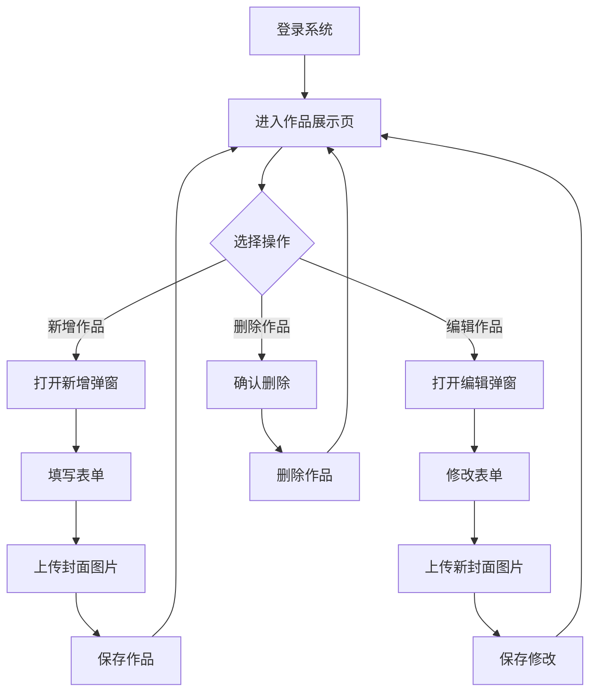
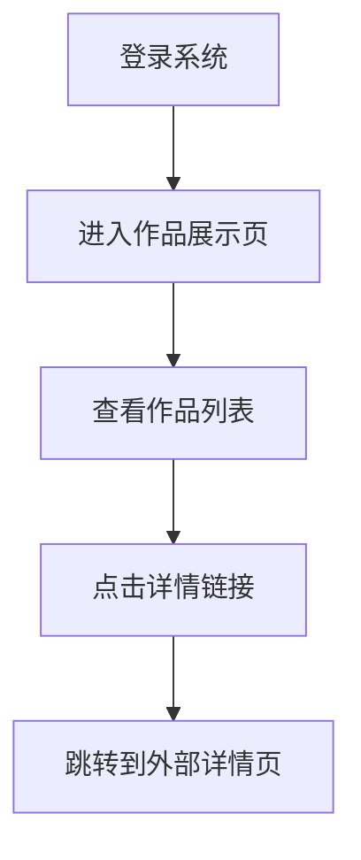
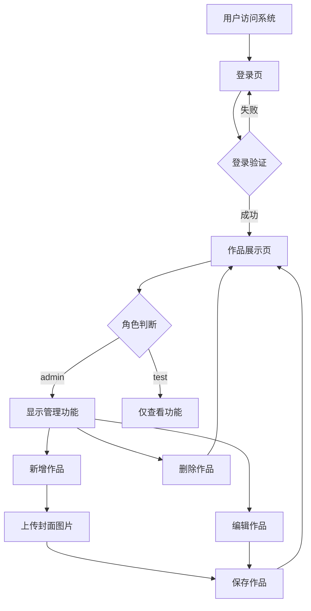

# 产品需求文档 - 产品经理个人作品展示系统

## 1. 需求概述
### 1.1 项目背景
产品经理需要一个个人作品展示系统，用于展示自己的项目案例，方便他人查看和了解其专业能力和项目经验。

### 1.2 项目目标
- 提供一个简洁美观的作品展示界面
- 支持管理员对作品的增删改查操作
- 支持作品封面图片上传
- 区分不同角色的权限，确保系统安全

### 1.3 核心功能
1. **用户认证**：登录功能，支持admin和test两种角色
2. **作品管理**：增删改查操作，仅admin角色可执行
3. **图片上传**：支持封面图片上传功能
4. **作品展示**：响应式布局，科技风界面

## 2. 功能说明
### 2.1 用户认证模块
- **登录功能**：
  - 输入用户名和密码
  - 验证用户身份
  - 登录成功后存储用户信息
  - 登录失败提示错误信息

### 2.2 作品管理模块
- **获取作品列表**：
  - 显示所有作品
  - 按照排序字段排序
  - 支持响应式布局

- **新增作品**：
  - 输入标题、描述、详情链接、排序
  - 上传封面图片
  - 保存作品信息

- **编辑作品**：
  - 修改现有作品信息
  - 重新上传封面图片
  - 保存修改

- **删除作品**：
  - 确认删除操作
  - 删除指定作品

### 2.3 图片上传模块
- **上传封面图片**：
  - 选择本地图片（jpg/png格式）
  - 上传图片到服务器
  - 返回可访问的图片URL

## 3. 用户操作流程
### 3.1 管理员操作流程

### 3.2 测试用户操作流程

## 4. 异常处理规则
1. **登录异常**：
   - 用户名或密码错误：提示"用户名或密码错误"
   - 账号过期：提示"账号已过期"

2. **作品操作异常**：
   - 权限不足：提示"权限不足，无法执行此操作"
   - 表单验证失败：提示具体的错误信息
   - 服务器错误：提示"服务器内部错误"

3. **图片上传异常**：
   - 文件格式错误：提示"请上传jpg或png格式的图片"
   - 文件大小超限：提示"图片大小不能超过限制"
   - 上传失败：提示"上传失败，请重试"

## 5. 权限管控规则
1. **角色定义**：
   - admin：管理员角色，拥有所有操作权限
   - test：测试角色，仅拥有查看权限

2. **权限控制**：
   - 登录接口：所有用户可访问
   - 获取作品列表：所有用户可访问
   - 新增作品：仅admin可访问
   - 编辑作品：仅admin可访问
   - 删除作品：仅admin可访问
   - 上传封面图片：仅admin可访问

## 6. 核心业务流程图

## 7. 用户旅程图
| 阶段 | 用户行为 | 系统响应 | 情感 |
| :--- | :--- | :--- | :--- |
| 登录 | 输入用户名和密码 | 验证身份并登录 | 期待 |
| 查看作品 | 浏览作品列表 | 展示作品卡片 | 满意 |
| 新增作品 | 填写表单，上传图片 | 保存作品并显示 | 兴奋 |
| 编辑作品 | 修改作品信息 | 保存修改并更新 | 专注 |
| 删除作品 | 确认删除操作 | 删除作品并更新列表 | 谨慎 |

## 8. 数据模型与字段定义
### 8.1 用户表（sys_user）
| 字段名 | 数据类型 | 约束 | 描述 |
| :--- | :--- | :--- | :--- |
| `id` | `BIGINT` | `PRIMARY KEY AUTO_INCREMENT` | 用户ID |
| `username` | `VARCHAR(50)` | `NOT NULL UNIQUE` | 账号 |
| `password` | `VARCHAR(100)` | `NOT NULL` | 密码 |
| `role` | `VARCHAR(20)` | `NOT NULL` | 角色（admin或test） |
| `expire_time` | `DATETIME` | `NOT NULL` | 过期时间 |
| `created_at` | `DATETIME` | `NOT NULL DEFAULT CURRENT_TIMESTAMP` | 创建时间 |

### 8.2 作品表（pm_project）
| 字段名 | 数据类型 | 约束 | 描述 |
| :--- | :--- | :--- | :--- |
| `id` | `BIGINT` | `PRIMARY KEY AUTO_INCREMENT` | 作品ID |
| `title` | `VARCHAR(255)` | `NOT NULL` | 标题 |
| `description` | `TEXT` | | 描述 |
| `cover_image` | `VARCHAR(500)` | | 封面图链接 |
| `detail_link` | `VARCHAR(500)` | | 详情跳转链接 |
| `github_link` | `VARCHAR(500)` | | GitHub链接 |
| `category_id` | `BIGINT` | | 分类ID |
| `sort` | `INT` | `NOT NULL DEFAULT 0` | 排序 |
| `created_at` | `DATETIME` | `NOT NULL DEFAULT CURRENT_TIMESTAMP` | 创建时间 |
| `updated_at` | `DATETIME` | `NOT NULL DEFAULT CURRENT_TIMESTAMP ON UPDATE CURRENT_TIMESTAMP` | 更新时间 |

### 8.3 简历表（pm_resume）
| 字段名 | 数据类型 | 约束 | 描述 |
| :--- | :--- | :--- | :--- |
| `id` | `BIGINT` | `PRIMARY KEY AUTO_INCREMENT` | 简历ID |
| `name` | `VARCHAR(50)` | `NOT NULL` | 姓名 |
| `email` | `VARCHAR(100)` | | 邮箱 |
| `phone` | `VARCHAR(20)` | | 电话 |
| `education` | `TEXT` | | 教育背景 |
| `work_experience` | `TEXT` | | 工作经验 |
| `skills` | `TEXT` | | 技能 |
| `projects` | `TEXT` | | 项目经验 |
| `self_introduction` | `TEXT` | | 自我介绍 |
| `resume_file` | `VARCHAR(500)` | | 简历文件URL |
| `resume_file_name` | `VARCHAR(255)` | | 简历文件名 |
| `gender` | `VARCHAR(10)` | | 性别 |
| `birth_date` | `VARCHAR(20)` | | 出生年月 |
| `work_start_date` | `VARCHAR(20)` | | 参加工作时间 |
| `job_status` | `VARCHAR(50)` | | 求职状态 |
| `user_type` | `VARCHAR(50)` | | 牛人身份 |
| `wechat` | `VARCHAR(50)` | | 微信号 |
| `personal_advantage` | `TEXT` | | 个人优势 |
| `expected_position` | `TEXT` | | 期望职位 |
| `created_at` | `DATETIME` | `NOT NULL DEFAULT CURRENT_TIMESTAMP` | 创建时间 |
| `updated_at` | `DATETIME` | `NOT NULL DEFAULT CURRENT_TIMESTAMP ON UPDATE CURRENT_TIMESTAMP` | 更新时间 |

## 9. 非功能需求
1. **响应式设计**：适配不同屏幕尺寸
2. **科技风界面**：现代、简洁的设计风格
3. **性能要求**：页面加载时间≤2秒，接口响应时间≤500ms
4. **安全性**：密码验证、权限控制、SQL注入防护
5. **可维护性**：代码结构清晰，注释完善

## 10. 验收标准
1. **功能验收**：
   - 登录功能正常，能正确验证用户名和密码
   - 角色权限控制有效，test用户无法执行管理操作
   - 作品增删改查操作正常
   - 图片上传功能正常，返回有效的URL

2. **界面验收**：
   - 响应式设计，适配不同屏幕尺寸
   - 科技风界面，美观整洁
   - 操作流程清晰，用户体验良好

3. **性能验收**：
   - 页面加载时间≤2秒
   - 接口响应时间≤500ms
   - 支持至少100个作品的展示

4. **安全性验收**：
   - 密码验证有效
   - 权限控制严格，未授权用户无法访问管理接口
   - 防止SQL注入和XSS攻击