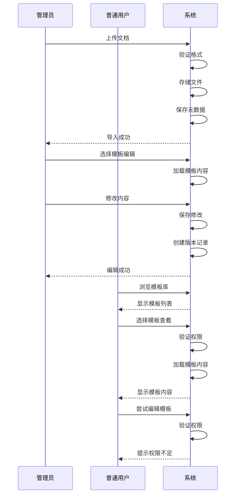

# 需求共识文档 - 模板库功能

## 1. 明确的业务目标与需求描述

### 1.1 业务目标
- 建立统一的模板库管理系统，为产品经理提供便捷的模板查找、使用和管理功能
- 实现模板的版本控制，确保模板的更新和维护
- 提供在线编辑功能，减少本地编辑的繁琐流程
- 通过权限控制，确保模板的安全性和管理的规范性

### 1.2 需求描述
- **核心功能**：模板库模块，支持文档导入、下载、在线查看和编辑功能
- **权限控制**：普通用户仅拥有查看权限，管理员拥有完整操作权限
- **分类管理**：实现模板分类系统，支持分类的创建、编辑和删除，文档可分配到多个分类
- **用户体验**：界面设计符合产品经理使用习惯，操作流程直观，性能优化
- **技术要求**：数据安全，文档加密存储，版本控制，系统可扩展性

## 2. 用户场景与核心流程

### 2.1 用户场景

#### 管理员场景
1. **导入模板**：管理员登录系统，进入模板库，点击"导入"按钮，选择本地文档上传，系统自动处理并存储
2. **管理分类**：管理员进入分类管理界面，创建新分类，编辑或删除现有分类
3. **编辑模板**：管理员选择需要编辑的模板，进入在线编辑界面，修改内容后保存
4. **下载模板**：管理员选择模板，点击"下载"按钮，系统保持原格式完整下载
5. **查看版本历史**：管理员查看模板的修改历史，可选择恢复到之前的版本

#### 普通用户场景
1. **浏览模板**：普通用户登录系统，进入模板库，浏览不同分类的模板
2. **搜索模板**：普通用户使用搜索功能查找特定模板
3. **在线查看**：普通用户点击模板，在线查看模板内容
4. **尝试编辑**：普通用户尝试编辑模板，系统提示权限不足
5. **尝试下载**：普通用户尝试下载模板，系统提示权限不足

### 2.2 核心流程

## 3. 可量化的验收标准

### 3.1 功能验收标准
- **文档导入**：成功导入Word、PDF、Markdown、TXT格式的文档，无数据丢失
- **文档下载**：保持原格式完整下载，内容和格式与原文件一致
- **在线查看**：不同格式文档正确渲染，加载时间不超过3秒
- **在线编辑**：支持基本文本格式化，编辑响应时间不超过1秒
- **分类管理**：成功创建、编辑、删除分类，文档可分配到多个分类

### 3.2 权限验收标准
- **普通用户**：仅能查看文档，尝试编辑、导入、下载时系统提示权限不足
- **管理员**：可执行所有操作，无权限限制
- **权限验证**：所有权限验证在服务端执行，前端权限控制仅作为辅助

### 3.3 性能验收标准
- **页面加载**：模板库页面加载时间不超过2秒
- **文档加载**：在线查看文档加载时间不超过3秒
- **操作响应**：编辑、保存等操作响应时间不超过1秒
- **并发处理**：支持100人同时在线访问模板库

### 3.4 兼容性验收标准
- **浏览器兼容**：在Chrome、Firefox、Safari、Edge主流浏览器中正常运行
- **设备兼容**：在桌面端和 tablet 设备上正常显示和操作

## 4. 产品与技术实现方案框架

### 4.1 产品方案
- **功能模块**：
  - 模板库首页：展示模板列表，支持分类筛选和搜索
  - 模板详情页：在线查看模板内容
  - 模板编辑页：在线编辑模板内容
  - 分类管理页：管理模板分类
  - 版本管理页：查看和管理模板版本

- **用户界面**：
  - 采用与现有系统一致的Element Plus UI风格
  - 操作流程直观，符合产品经理使用习惯
  - 响应式设计，适配不同设备

### 4.2 技术方案
- **后端技术**：
  - Spring Boot 3.2.0
  - Spring Data JPA
  - MySQL 8.0+
  - JWT认证

- **前端技术**：
  - Vue 3
  - Element Plus
  - Axios
  - 富文本编辑器（Quill.js）

- **存储方案**：
  - 文件系统：存储文档文件
  - 数据库：存储模板元数据、分类信息、版本记录

- **安全方案**：
  - 文档加密：AES加密算法
  - 权限控制：基于RBAC模型
  - 防SQL注入：参数化查询
  - 防XSS：输入验证和转义

## 5. 技术与业务约束

### 5.1 技术约束
- **文档格式**：支持Word(.docx)、PDF(.pdf)、Markdown(.md)、TXT(.txt)格式
- **文档大小**：单个文档大小限制为50MB
- **存储容量**：系统总存储容量根据服务器配置而定
- **在线编辑**：仅支持文本类文档的在线编辑，PDF等格式仅支持查看

### 5.2 业务约束
- **权限控制**：严格按照角色权限执行，无例外情况
- **版本控制**：保留最近10个版本的历史记录
- **分类管理**：至少包含"需求文档"和"模型理论"两个默认分类
- **用户体验**：操作流程必须直观，符合产品经理使用习惯

## 6. 任务边界限制

### 6.1 功能边界
- **核心功能**：导入、下载、在线查看、在线编辑
- **辅助功能**：分类管理、版本控制、权限控制
- **不包含**：复杂的文档格式转换、高级文档编辑功能、模板内容的业务逻辑

### 6.2 技术边界
- **技术栈**：使用现有系统的技术栈，不引入新的技术框架
- **架构**：保持现有系统架构，不修改核心架构
- **集成**：与现有系统无缝集成，复用现有功能模块

## 7. 关键假设与确认记录

| 序号 | 假设/确认项 | 说明 | 状态 |
| --- | --- | --- | --- |
| 1 | 文档存储方式 | 使用文件系统存储文档文件，数据库存储元数据 | 已确认 |
| 2 | 文档格式支持 | 支持Word、PDF、Markdown、TXT格式 | 已确认 |
| 3 | 在线编辑技术 | 使用Quill.js作为富文本编辑器 | 已确认 |
| 4 | 版本控制实现 | 基于时间的版本快照，保留最近10个版本 | 已确认 |
| 5 | 文档加密方式 | 使用AES加密算法 | 已确认 |
| 6 | 权限控制策略 | 普通用户仅可查看，管理员拥有完整权限 | 已确认 |
| 7 | 默认分类 | 需求文档、模型理论 | 已确认 |

## 8. 需求变更管控规则

- **变更申请**：所有需求变更必须通过正式的变更申请流程
- **影响评估**：变更申请需评估对现有功能的影响
- **审批流程**：变更需经过产品、技术、测试团队的审批
- **版本管理**：变更后需更新相关文档版本
- **测试验证**：变更后需进行相应的测试验证

## 9. 结论

本需求共识文档明确了模板库功能的业务目标、需求描述、用户场景、核心流程、验收标准和技术实现方案。该功能将为产品经理提供便捷的模板管理和使用体验，同时通过严格的权限控制确保系统的安全性。

所有相关方已达成共识，同意按照本文档的要求实施模板库功能。