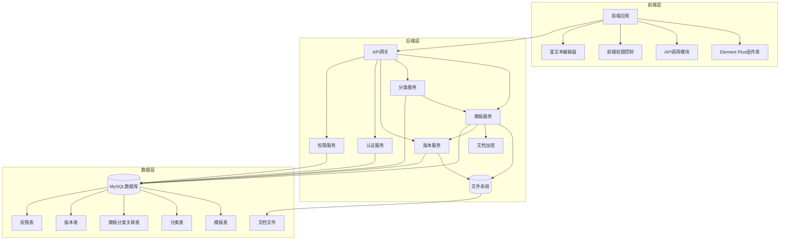
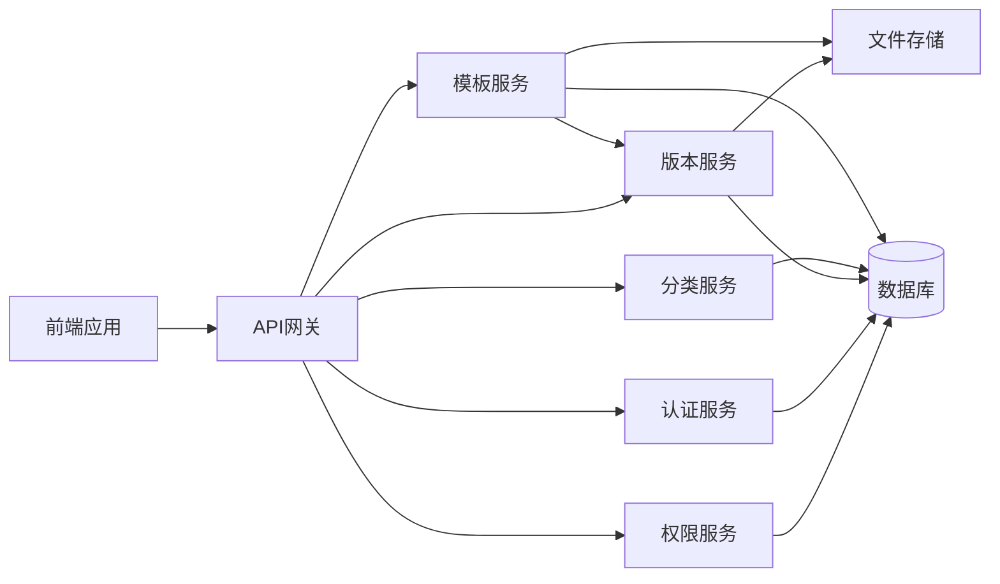
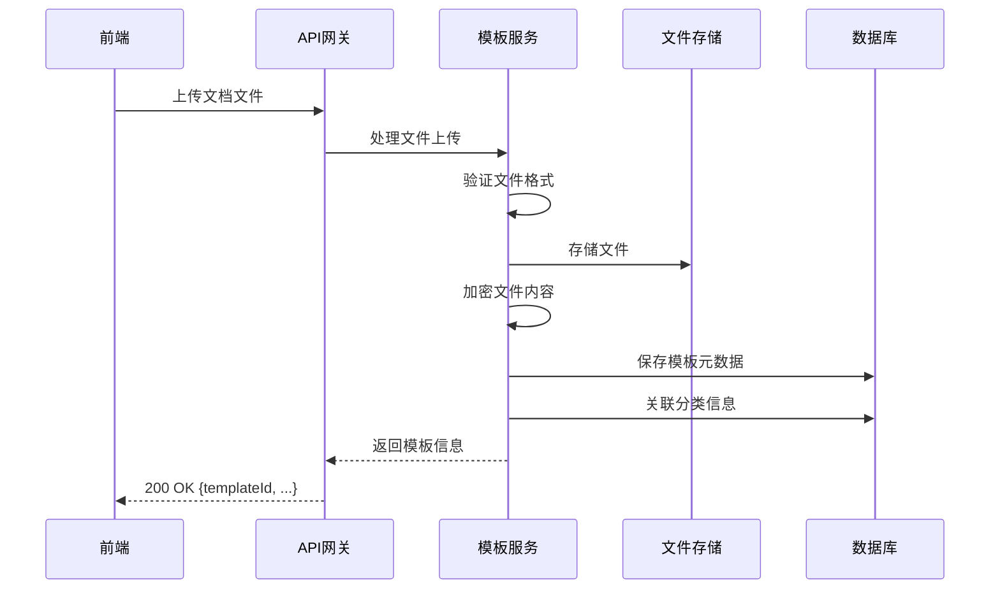
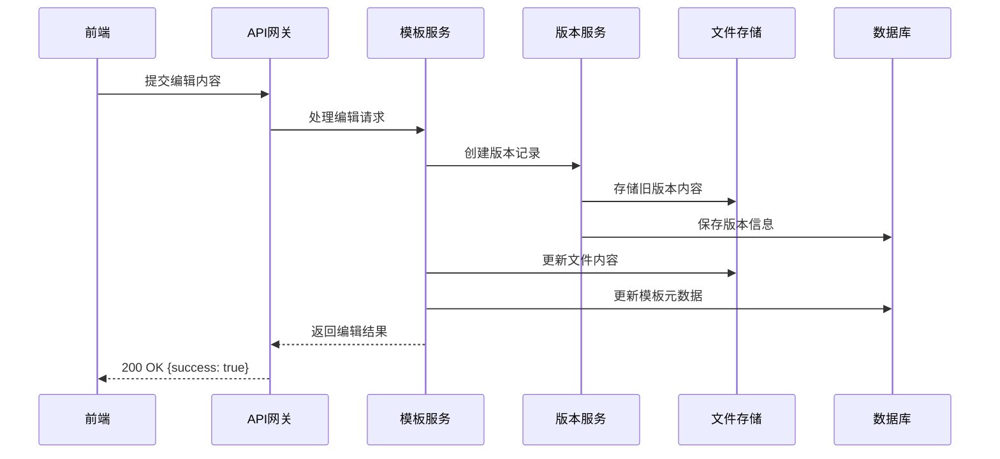
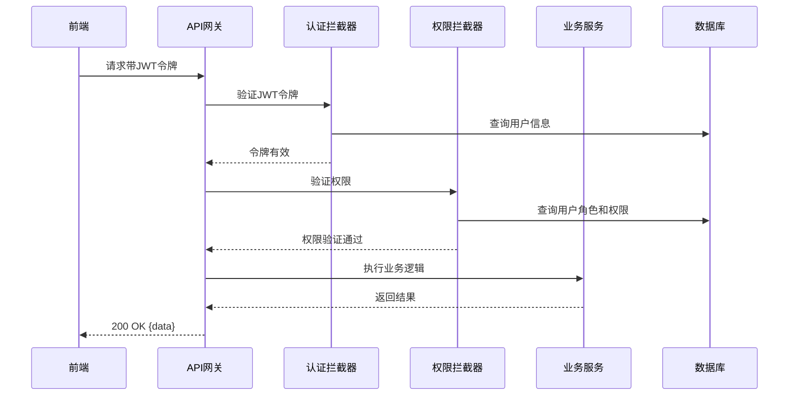

# 技术架构设计文档 - 模板库功能

## 1. 整体架构图



## 2. 系统分层设计与核心组件定义

### 2.1 后端分层

| 层级 | 组件 | 职责 | 技术实现 |
| --- | --- | --- | --- |
| API层 | 控制器 | 处理HTTP请求，参数验证，响应格式化 | Spring Boot Web |
| 服务层 | 模板服务 | 模板的增删改查，导入导出 | Spring Boot Service |
| 服务层 | 分类服务 | 分类的增删改查，分类管理 | Spring Boot Service |
| 服务层 | 版本服务 | 版本管理，历史记录 | Spring Boot Service |
| 服务层 | 认证服务 | 用户认证，JWT管理 | Spring Security |
| 服务层 | 权限服务 | 权限验证，角色管理 | 自定义权限框架 |
| 数据访问层 | 仓库 | 数据访问，数据库操作 | Spring Data JPA |
| 存储层 | 文件存储 | 文档文件存储 | 文件系统 |
| 工具层 | 加密工具 | 文档内容加密 | AES算法 |
| 工具层 | 文件工具 | 文件处理，格式转换 | Apache POI |

### 2.2 前端组件

| 组件 | 职责 | 技术实现 |
| --- | --- | --- |
| 模板库首页 | 模板列表展示，分类筛选，搜索 | Vue 3 + Element Plus |
| 模板详情页 | 在线查看模板内容 | Vue 3 + Element Plus + 预览组件 |
| 模板编辑页 | 在线编辑模板内容 | Vue 3 + Element Plus + Quill.js |
| 分类管理页 | 分类的创建、编辑、删除 | Vue 3 + Element Plus |
| 版本管理页 | 版本历史查看，版本恢复 | Vue 3 + Element Plus |
| 权限控制 | 基于角色的前端权限管理 | 自定义权限指令 |

## 3. 模块依赖关系图



## 4. 接口契约完整定义

### 4.1 模板管理接口

#### 4.1.1 获取模板列表
- **请求方式**：GET
- **接口路径**：/api/template/list
- **权限要求**：所有用户
- **请求参数**：
  | 参数名 | 类型 | 必须 | 描述 |
  | --- | --- | --- | --- |
  | categoryId | Long | 否 | 分类ID |
  | keyword | String | 否 | 搜索关键词 |
  | page | Integer | 否 | 页码 |
  | size | Integer | 否 | 每页大小 |
- **返回参数**：
  ```json
  {
    "code": 200,
    "message": "成功",
    "data": {
      "total": 100,
      "items": [
        {
          "id": 1,
          "name": "产品需求文档模板",
          "description": "产品需求文档模板",
          "format": "docx",
          "size": 1024000,
          "createTime": "2026-03-27T10:00:00",
          "updateTime": "2026-03-27T10:00:00",
          "categories": [
            {
              "id": 1,
              "name": "需求文档"
            }
          ]
        }
      ]
    }
  }
  ```

#### 4.1.2 导入模板
- **请求方式**：POST
- **接口路径**：/api/template/import
- **权限要求**：管理员
- **请求参数**：multipart/form-data
  | 参数名 | 类型 | 必须 | 描述 |
  | --- | --- | --- | --- |
  | file | File | 是 | 文档文件 |
  | name | String | 是 | 模板名称 |
  | description | String | 否 | 模板描述 |
  | categoryIds | Long[] | 否 | 分类ID列表 |
- **返回参数**：
  ```json
  {
    "code": 200,
    "message": "导入成功",
    "data": {
      "id": 1,
      "name": "产品需求文档模板",
      "description": "产品需求文档模板",
      "format": "docx",
      "size": 1024000
    }
  }
  ```

#### 4.1.3 下载模板
- **请求方式**：GET
- **接口路径**：/api/template/download/{id}
- **权限要求**：管理员
- **返回参数**：文件流

#### 4.1.4 在线查看模板
- **请求方式**：GET
- **接口路径**：/api/template/view/{id}
- **权限要求**：所有用户
- **返回参数**：
  ```json
  {
    "code": 200,
    "message": "成功",
    "data": {
      "id": 1,
      "name": "产品需求文档模板",
      "content": "<html>...</html>",
      "format": "docx"
    }
  }
  ```

#### 4.1.5 编辑模板
- **请求方式**：PUT
- **接口路径**：/api/template/edit/{id}
- **权限要求**：管理员
- **请求参数**：
  ```json
  {
    "content": "<html>...</html>",
    "name": "产品需求文档模板",
    "description": "产品需求文档模板",
    "categoryIds": [1, 2]
  }
  ```
- **返回参数**：
  ```json
  {
    "code": 200,
    "message": "编辑成功",
    "data": {
      "id": 1,
      "name": "产品需求文档模板",
      "updateTime": "2026-03-27T10:00:00"
    }
  }
  ```

#### 4.1.6 删除模板
- **请求方式**：DELETE
- **接口路径**：/api/template/delete/{id}
- **权限要求**：管理员
- **返回参数**：
  ```json
  {
    "code": 200,
    "message": "删除成功",
    "data": null
  }
  ```

### 4.2 分类管理接口

#### 4.2.1 获取分类列表
- **请求方式**：GET
- **接口路径**：/api/template/category/list
- **权限要求**：所有用户
- **返回参数**：
  ```json
  {
    "code": 200,
    "message": "成功",
    "data": [
      {
        "id": 1,
        "name": "需求文档",
        "description": "产品需求相关文档",
        "templateCount": 10
      },
      {
        "id": 2,
        "name": "模型理论",
        "description": "产品模型和理论相关文档",
        "templateCount": 5
      }
    ]
  }
  ```

#### 4.2.2 创建分类
- **请求方式**：POST
- **接口路径**：/api/template/category/create
- **权限要求**：管理员
- **请求参数**：
  ```json
  {
    "name": "用户研究",
    "description": "用户研究相关文档"
  }
  ```
- **返回参数**：
  ```json
  {
    "code": 200,
    "message": "创建成功",
    "data": {
      "id": 3,
      "name": "用户研究",
      "description": "用户研究相关文档"
    }
  }
  ```

#### 4.2.3 编辑分类
- **请求方式**：PUT
- **接口路径**：/api/template/category/edit/{id}
- **权限要求**：管理员
- **请求参数**：
  ```json
  {
    "name": "用户研究与分析",
    "description": "用户研究与分析相关文档"
  }
  ```
- **返回参数**：
  ```json
  {
    "code": 200,
    "message": "编辑成功",
    "data": {
      "id": 3,
      "name": "用户研究与分析",
      "description": "用户研究与分析相关文档"
    }
  }
  ```

#### 4.2.4 删除分类
- **请求方式**：DELETE
- **接口路径**：/api/template/category/delete/{id}
- **权限要求**：管理员
- **返回参数**：
  ```json
  {
    "code": 200,
    "message": "删除成功",
    "data": null
  }
  ```

### 4.3 版本管理接口

#### 4.3.1 获取版本历史
- **请求方式**：GET
- **接口路径**：/api/template/version/{templateId}
- **权限要求**：管理员
- **返回参数**：
  ```json
  {
    "code": 200,
    "message": "成功",
    "data": [
      {
        "id": 1,
        "version": "v1.0",
        "createTime": "2026-03-27T10:00:00",
        "creator": "admin",
        "description": "初始版本"
      },
      {
        "id": 2,
        "version": "v1.1",
        "createTime": "2026-03-27T11:00:00",
        "creator": "admin",
        "description": "更新内容"
      }
    ]
  }
  ```

#### 4.3.2 恢复版本
- **请求方式**：POST
- **接口路径**：/api/template/version/restore/{versionId}
- **权限要求**：管理员
- **返回参数**：
  ```json
  {
    "code": 200,
    "message": "恢复成功",
    "data": {
      "id": 1,
      "version": "v1.0",
      "restoreTime": "2026-03-27T12:00:00"
    }
  }
  ```

## 5. 核心业务数据流向图

### 5.1 模板导入流程



### 5.2 模板编辑流程



### 5.3 权限验证流程



## 6. 数据库表结构设计

### 6.1 模板表 (template)

| 字段名 | 数据类型 | 约束 | 描述 |
| --- | --- | --- | --- |
| id | BIGINT | PRIMARY KEY AUTO_INCREMENT | 模板ID |
| name | VARCHAR(255) | NOT NULL | 模板名称 |
| description | TEXT | | 模板描述 |
| file_path | VARCHAR(512) | NOT NULL | 文件存储路径 |
| format | VARCHAR(50) | NOT NULL | 文件格式 |
| size | BIGINT | NOT NULL | 文件大小（字节） |
| content_hash | VARCHAR(128) | | 内容哈希值 |
| is_encrypted | BOOLEAN | NOT NULL DEFAULT TRUE | 是否加密 |
| created_by | BIGINT | FOREIGN KEY | 创建者ID |
| updated_by | BIGINT | FOREIGN KEY | 更新者ID |
| created_at | DATETIME | NOT NULL DEFAULT CURRENT_TIMESTAMP | 创建时间 |
| updated_at | DATETIME | NOT NULL DEFAULT CURRENT_TIMESTAMP ON UPDATE CURRENT_TIMESTAMP | 更新时间 |

**索引**：
- 主键索引：id
- 普通索引：name, format, created_by

### 6.2 分类表 (template_category)

| 字段名 | 数据类型 | 约束 | 描述 |
| --- | --- | --- | --- |
| id | BIGINT | PRIMARY KEY AUTO_INCREMENT | 分类ID |
| name | VARCHAR(100) | NOT NULL UNIQUE | 分类名称 |
| description | TEXT | | 分类描述 |
| created_by | BIGINT | FOREIGN KEY | 创建者ID |
| updated_by | BIGINT | FOREIGN KEY | 更新者ID |
| created_at | DATETIME | NOT NULL DEFAULT CURRENT_TIMESTAMP | 创建时间 |
| updated_at | DATETIME | NOT NULL DEFAULT CURRENT_TIMESTAMP ON UPDATE CURRENT_TIMESTAMP | 更新时间 |

**索引**：
- 主键索引：id
- 唯一索引：name

### 6.3 模板分类关联表 (template_category_relation)

| 字段名 | 数据类型 | 约束 | 描述 |
| --- | --- | --- | --- |
| id | BIGINT | PRIMARY KEY AUTO_INCREMENT | 关联ID |
| template_id | BIGINT | NOT NULL FOREIGN KEY | 模板ID |
| category_id | BIGINT | NOT NULL FOREIGN KEY | 分类ID |
| created_at | DATETIME | NOT NULL DEFAULT CURRENT_TIMESTAMP | 创建时间 |

**索引**：
- 主键索引：id
- 联合唯一索引：(template_id, category_id)
- 普通索引：template_id, category_id

### 6.4 版本表 (template_version)

| 字段名 | 数据类型 | 约束 | 描述 |
| --- | --- | --- | --- |
| id | BIGINT | PRIMARY KEY AUTO_INCREMENT | 版本ID |
| template_id | BIGINT | NOT NULL FOREIGN KEY | 模板ID |
| version | VARCHAR(50) | NOT NULL | 版本号 |
| file_path | VARCHAR(512) | NOT NULL | 版本文件路径 |
| description | TEXT | | 版本描述 |
| created_by | BIGINT | FOREIGN KEY | 创建者ID |
| created_at | DATETIME | NOT NULL DEFAULT CURRENT_TIMESTAMP | 创建时间 |

**索引**：
- 主键索引：id
- 普通索引：template_id, version

### 6.5 权限表扩展 (permission)

| 字段名 | 数据类型 | 约束 | 描述 |
| --- | --- | --- | --- |
| id | BIGINT | PRIMARY KEY AUTO_INCREMENT | 权限ID |
| permission_name | VARCHAR(100) | NOT NULL | 权限名称 |
| permission_code | VARCHAR(100) | NOT NULL UNIQUE | 权限代码 |
| description | TEXT | | 权限描述 |
| permission_type | VARCHAR(20) | NOT NULL | 权限类型 |
| is_enabled | BOOLEAN | NOT NULL DEFAULT TRUE | 是否启用 |
| created_at | DATETIME | NOT NULL DEFAULT CURRENT_TIMESTAMP | 创建时间 |
| updated_at | DATETIME | NOT NULL DEFAULT CURRENT_TIMESTAMP ON UPDATE CURRENT_TIMESTAMP | 更新时间 |

**新增权限代码**：
- TEMPLATE_VIEW：模板查看权限
- TEMPLATE_EDIT：模板编辑权限
- TEMPLATE_IMPORT：模板导入权限
- TEMPLATE_DOWNLOAD：模板下载权限
- TEMPLATE_CATEGORY_MANAGE：分类管理权限

## 7. 全局异常处理策略

### 7.1 异常分类
- **业务异常**：如参数校验失败、权限不足、文件格式不支持等
- **系统异常**：如数据库连接失败、文件存储失败等
- **安全异常**：如认证失败、恶意请求等

### 7.2 处理机制
- **统一异常处理器**：使用@ControllerAdvice捕获全局异常
- **错误码体系**：
  - 200：成功
  - 400：请求参数错误
  - 401：未授权
  - 403：权限不足
  - 415：文件格式不支持
  - 500：服务器内部错误

- **异常日志记录**：详细记录异常信息，便于排查
- **降级方案**：在文件存储失败时提供降级服务，确保核心功能可用

## 8. 安全设计与合规适配方案

### 8.1 安全设计
- **文档加密**：使用AES-256加密算法对文档内容进行加密存储
- **权限验证**：基于RBAC模型的权限控制，细粒度权限管理
- **文件上传安全**：
  - 文件类型验证
  - 文件大小限制
  - 防病毒扫描
  - 文件名随机化
- **防SQL注入**：使用Spring Data JPA的参数化查询
- **防XSS**：对用户输入进行过滤和转义
- **HTTPS传输**：所有API请求使用HTTPS传输

### 8.2 合规适配
- **数据隐私**：文档内容加密存储，保护用户数据隐私
- **审计日志**：记录所有敏感操作，支持合规审计
- **数据备份**：定期备份模板数据，确保数据安全
- **数据导出**：支持模板数据导出，满足合规要求

## 9. 性能优化方案

### 9.1 前端优化
- **组件懒加载**：按需加载模板库相关组件
- **缓存策略**：缓存模板列表和分类信息
- **虚拟滚动**：使用虚拟列表优化大数据渲染
- **图片懒加载**：模板预览图懒加载
- **请求优化**：合并请求，减少HTTP请求次数

### 9.2 后端优化
- **缓存机制**：使用Redis缓存热点模板数据
- **文件存储优化**：
  - 大文件分块上传
  - 文件压缩存储
  - CDN加速静态资源
- **数据库优化**：
  - 合理设计索引
  - 优化查询语句
  - 批量操作减少数据库交互
- **异步处理**：使用消息队列处理文件上传和处理
- **连接池**：使用数据库连接池，减少连接开销

### 9.3 存储优化
- **文件系统优化**：使用高效的文件系统存储文档
- **存储分层**：热数据和冷数据分离存储
- **备份策略**：定期备份文件系统数据

## 10. 部署与集成方案

### 10.1 部署架构
- **容器化部署**：使用Docker容器化部署，便于管理和扩展
- **文件存储**：使用NFS或对象存储服务存储文档文件
- **数据库**：使用MySQL数据库存储元数据
- **缓存**：使用Redis缓存热点数据

### 10.2 集成方案
- **与现有系统集成**：通过API接口与现有系统集成
- **权限系统集成**：复用现有系统的权限管理功能
- **用户系统集成**：复用现有系统的用户管理功能

## 11. 技术栈与依赖

| 技术/依赖 | 版本 | 用途 |
| --- | --- | --- |
| Spring Boot | 3.2.0 | 后端框架 |
| Spring Data JPA | 3.2.0 | ORM框架 |
| Spring Security | 3.2.0 | 安全框架 |
| MySQL | 8.0+ | 数据库 |
| Vue 3 | 3.3.0 | 前端框架 |
| Element Plus | 2.4.0 | UI组件库 |
| Axios | 1.6.0 | HTTP客户端 |
| Quill.js | 1.3.7 | 富文本编辑器 |
| Apache POI | 5.2.0 | Office文档处理 |
| JWT | 0.11.2 | 认证令牌 |
| Redis | 7.0+ | 缓存 |
| Docker | 20.10+ | 容器化 |

## 12. 开发与测试计划

### 12.1 开发计划
1. **后端开发**：
   - 数据模型和数据库表结构实现
   - 模板服务、分类服务、版本服务实现
   - API接口实现
   - 权限控制实现

2. **前端开发**：
   - 模板库首页实现
   - 模板详情页和编辑页实现
   - 分类管理页实现
   - 版本管理页实现
   - 权限控制前端实现

3. **集成测试**：
   - 前后端集成测试
   - 功能验证测试
   - 权限控制测试

### 12.2 测试计划
1. **单元测试**：测试核心功能和组件
2. **集成测试**：测试模块间集成
3. **端到端测试**：测试完整业务流程
4. **安全测试**：测试系统安全性
5. **性能测试**：测试系统性能和并发能力
6. **兼容性测试**：测试不同浏览器和设备

## 13. 风险与应对策略

| 风险 | 应对策略 |
| --- | --- |
| 文档格式兼容性问题 | 限制支持的文档格式，提供格式转换工具 |
| 文件存储容量限制 | 实现文件大小限制，监控存储使用情况 |
| 在线编辑性能问题 | 使用轻量级编辑器，实现增量保存 |
| 权限控制绕过 | 服务端严格权限验证，前端权限控制仅作为辅助 |
| 系统安全漏洞 | 定期安全扫描，及时修复漏洞 |
| 文档内容泄露 | 加密存储，访问控制，审计日志 |

## 14. 未来扩展规划

- **支持更多文档格式**：如Excel、PPT等
- **模板预览功能**：生成模板预览图
- **模板推荐系统**：基于用户行为推荐模板
- **模板协作编辑**：支持多人同时编辑模板
- **模板评论和评分**：用户可以对模板进行评论和评分
- **模板版本对比**：可视化对比不同版本的差异
- **模板导出为多种格式**：支持将模板导出为不同格式
