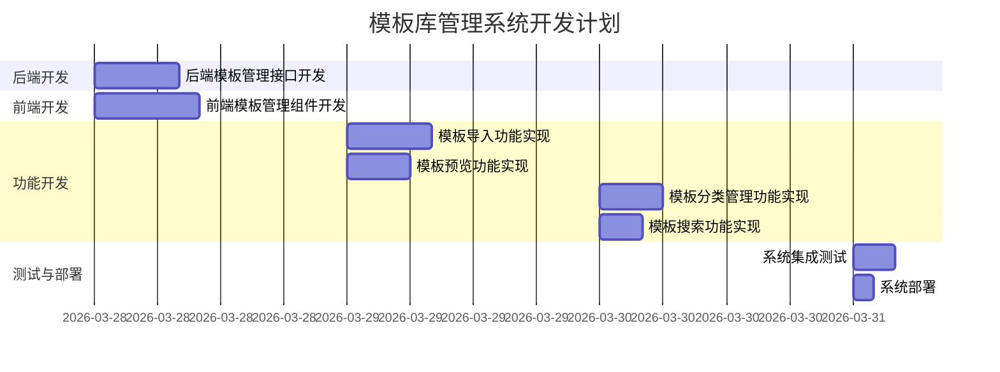

# 模板库管理系统 - 原子任务文档

## 任务拆分概述

基于 `DESIGN_template-library.md` 设计文档，将模板库管理系统的开发任务拆分为可独立执行、可独立验收的原子任务。

## 原子任务列表

### 1. 后端模板管理接口开发

**任务ID**: TASK-001
**所属模块**: 后端核心功能
**负责角色**: 后端开发
**预估工时**: 8小时
**优先级**: 高

**输入契约**:
- 前置依赖: 数据库表结构设计完成
- 输入文档: `DESIGN_template-library.md`、`CONSENSUS_template-library.md`

**输出契约**:
- 交付物: 完整的模板管理接口实现
- 文档更新: 更新API接口文档
- 验收标准: 所有模板管理接口正常运行，符合设计规范

**实现约束**:
- 严格按照设计文档中的接口定义实现
- 遵循项目代码规范
- 确保接口安全性和可靠性

**依赖关系**:
- 前置任务: 数据库表结构设计
- 可并行任务: 前端模板管理组件开发
- 后置任务: 系统集成测试

### 2. 前端模板管理组件开发

**任务ID**: TASK-002
**所属模块**: 前端核心功能
**负责角色**: 前端开发
**预估工时**: 10小时
**优先级**: 高

**输入契约**:
- 前置依赖: 后端模板管理接口设计完成
- 输入文档: `UI_SPEC_template-library.md`、`DESIGN_template-library.md`

**输出契约**:
- 交付物: 完整的模板管理前端组件
- 文档更新: 无
- 验收标准: 前端组件功能完整，UI符合设计规范

**实现约束**:
- 严格按照UI设计规范实现
- 确保响应式设计
- 遵循前端代码规范

**依赖关系**:
- 前置任务: 后端模板管理接口设计
- 可并行任务: 后端模板管理接口开发
- 后置任务: 系统集成测试

### 3. 模板导入功能实现

**任务ID**: TASK-003
**所属模块**: 核心功能
**负责角色**: 全栈开发
**预估工时**: 8小时
**优先级**: 中

**输入契约**:
- 前置依赖: 模板管理接口和组件开发完成
- 输入文档: `PRD_template-library.md`、`DESIGN_template-library.md`

**输出契约**:
- 交付物: 完整的模板导入功能
- 文档更新: 更新相关接口文档
- 验收标准: 模板导入功能正常运行，支持各种模板格式

**实现约束**:
- 支持多种模板格式导入
- 确保导入过程的安全性
- 提供清晰的导入反馈

**依赖关系**:
- 前置任务: 后端模板管理接口开发、前端模板管理组件开发
- 可并行任务: 模板预览功能实现
- 后置任务: 系统集成测试

### 4. 模板预览功能实现

**任务ID**: TASK-004
**所属模块**: 核心功能
**负责角色**: 全栈开发
**预估工时**: 6小时
**优先级**: 中

**输入契约**:
- 前置依赖: 模板管理接口和组件开发完成
- 输入文档: `PRD_template-library.md`、`DESIGN_template-library.md`

**输出契约**:
- 交付物: 完整的模板预览功能
- 文档更新: 更新相关接口文档
- 验收标准: 模板预览功能正常运行，显示效果良好

**实现约束**:
- 支持多种模板格式预览
- 确保预览性能
- 提供清晰的预览界面

**依赖关系**:
- 前置任务: 后端模板管理接口开发、前端模板管理组件开发
- 可并行任务: 模板导入功能实现
- 后置任务: 系统集成测试

### 5. 模板分类管理功能实现

**任务ID**: TASK-005
**所属模块**: 核心功能
**负责角色**: 全栈开发
**预估工时**: 6小时
**优先级**: 中

**输入契约**:
- 前置依赖: 模板管理接口和组件开发完成
- 输入文档: `PRD_template-library.md`、`DESIGN_template-library.md`

**输出契约**:
- 交付物: 完整的模板分类管理功能
- 文档更新: 更新相关接口文档
- 验收标准: 模板分类管理功能正常运行，支持分类的增删改查

**实现约束**:
- 支持多级分类
- 确保分类操作的安全性
- 提供清晰的分类管理界面

**依赖关系**:
- 前置任务: 后端模板管理接口开发、前端模板管理组件开发
- 可并行任务: 模板搜索功能实现
- 后置任务: 系统集成测试

### 6. 模板搜索功能实现

**任务ID**: TASK-006
**所属模块**: 核心功能
**负责角色**: 全栈开发
**预估工时**: 4小时
**优先级**: 中

**输入契约**:
- 前置依赖: 模板管理接口和组件开发完成
- 输入文档: `PRD_template-library.md`、`DESIGN_template-library.md`

**输出契约**:
- 交付物: 完整的模板搜索功能
- 文档更新: 更新相关接口文档
- 验收标准: 模板搜索功能正常运行，搜索结果准确

**实现约束**:
- 支持关键词搜索
- 支持分类筛选
- 确保搜索性能

**依赖关系**:
- 前置任务: 后端模板管理接口开发、前端模板管理组件开发
- 可并行任务: 模板分类管理功能实现
- 后置任务: 系统集成测试

### 7. 系统集成测试

**任务ID**: TASK-007
**所属模块**: 测试
**负责角色**: 测试人员
**预估工时**: 4小时
**优先级**: 高

**输入契约**:
- 前置依赖: 所有功能开发完成
- 输入文档: `TEST_CASE_template-library.md`、`PRD_template-library.md`

**输出契约**:
- 交付物: 测试报告
- 文档更新: 更新验收记录文档
- 验收标准: 所有测试用例通过，系统运行正常

**实现约束**:
- 覆盖所有功能点
- 测试边界情况
- 确保系统稳定性

**依赖关系**:
- 前置任务: 所有功能开发任务
- 可并行任务: 无
- 后置任务: 系统部署

### 8. 系统部署

**任务ID**: TASK-008
**所属模块**: 部署
**负责角色**: 运维人员
**预估工时**: 2小时
**优先级**: 高

**输入契约**:
- 前置依赖: 系统集成测试通过
- 输入文档: 部署指南

**输出契约**:
- 交付物: 部署完成的系统
- 文档更新: 更新部署文档
- 验收标准: 系统正常运行，可访问

**实现约束**:
- 确保部署环境配置正确
- 确保系统安全
- 提供部署文档

**依赖关系**:
- 前置任务: 系统集成测试
- 可并行任务: 无
- 后置任务: 系统验收

## 任务执行计划

### 任务依赖关系图

## 执行注意事项

1. **严格遵循设计文档**：所有开发任务必须严格按照设计文档执行，确保实现与设计一致。
2. **及时同步文档**：开发过程中如有设计变更，必须及时更新相关文档。
3. **质量优先**：每个任务完成后必须进行充分测试，确保功能正常。
4. **沟通协作**：前后端开发人员必须保持密切沟通，确保接口对接顺畅。
5. **安全第一**：所有功能必须考虑安全性，防止恶意攻击。

## 验收标准

每个任务完成后，必须满足以下验收标准：

1. **功能完整性**：所有功能点均已实现，无遗漏。
2. **代码质量**：代码符合项目规范，可读性好，无冗余代码。
3. **性能良好**：功能响应速度快，无明显卡顿。
4. **安全性**：无安全漏洞，数据传输安全。
5. **文档完整**：相关文档已更新，与实现一致。

## 风险预案

1. **技术风险**：如遇到技术难题，及时组织技术讨论，寻求解决方案。
2. **时间风险**：如任务延期，及时调整计划，确保整体进度不受影响。
3. **质量风险**：如发现质量问题，及时修复，确保系统稳定性。
4. **沟通风险**：建立定期沟通机制，确保信息畅通。