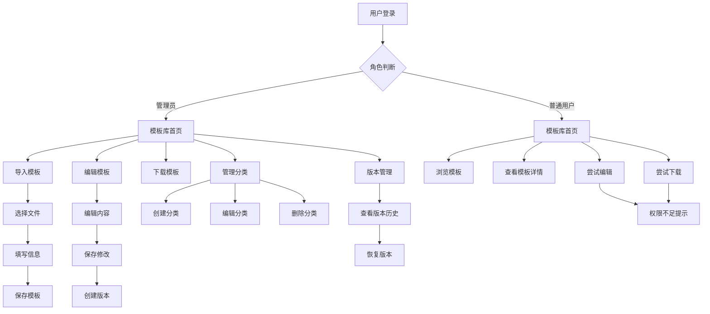

# 产品需求文档 - 模板库功能

## 1. 产品概览

### 1.1 功能简介
模板库是"产品经理补给站"系统的核心功能模块，为产品经理提供统一的模板管理、查找、使用和编辑平台。该功能支持文档的导入、下载、在线查看和编辑，实现模板的分类管理和版本控制，并通过严格的权限控制确保模板的安全性。

### 1.2 目标用户
- **产品经理**：使用模板库查找、查看和使用模板
- **系统管理员**：管理模板库，包括导入、编辑、分类管理等

### 1.3 价值主张
- **提高效率**：统一管理模板，减少重复工作
- **标准化**：提供规范的模板，确保输出质量
- **便捷性**：在线编辑和查看，无需本地工具
- **安全性**：严格的权限控制，保护敏感模板

## 2. 核心功能

### 2.1 功能模块

#### 2.1.1 模板库首页
- **模板列表**：展示模板列表，支持分页、排序和搜索
- **分类筛选**：按分类筛选模板
- **搜索功能**：支持按模板名称和描述搜索
- **操作按钮**：导入、批量操作等按钮（仅管理员可见）

#### 2.1.2 模板详情页
- **模板信息**：显示模板名称、描述、格式、大小等信息
- **在线查看**：在线预览模板内容
- **操作按钮**：编辑、下载、删除等按钮（根据权限显示）
- **版本历史**：查看模板的版本历史（仅管理员可见）

#### 2.1.3 模板编辑页
- **富文本编辑器**：支持基本文本格式化和内容修改
- **保存功能**：保存编辑内容，自动创建版本记录
- **取消功能**：放弃编辑，返回详情页

#### 2.1.4 分类管理页
- **分类列表**：展示所有分类，包括分类名称、描述和模板数量
- **操作按钮**：创建、编辑、删除分类（仅管理员可见）
- **默认分类**：包含"需求文档"和"模型理论"两个默认分类

#### 2.1.5 版本管理页
- **版本列表**：展示模板的所有版本，包括版本号、创建时间、创建者和描述
- **操作按钮**：恢复版本（仅管理员可见）

### 2.2 页面详情

| 页面名称 | 模块名称 | 功能描述 |
| --- | --- | --- |
| 模板库首页 | 模板列表 | 展示模板列表，支持分页、排序和搜索，显示模板名称、描述、格式、大小等信息 |
| 模板库首页 | 分类筛选 | 按分类筛选模板，显示分类名称和模板数量 |
| 模板库首页 | 操作按钮 | 导入模板按钮（仅管理员可见），批量操作按钮（仅管理员可见） |
| 模板详情页 | 模板信息 | 显示模板详细信息，包括名称、描述、格式、大小、创建时间、更新时间等 |
| 模板详情页 | 在线查看 | 在线预览模板内容，支持不同格式的文档预览 |
| 模板详情页 | 操作按钮 | 编辑按钮（仅管理员可见），下载按钮（仅管理员可见），删除按钮（仅管理员可见） |
| 模板详情页 | 版本历史 | 查看模板的版本历史，显示版本号、创建时间、创建者等信息（仅管理员可见） |
| 模板编辑页 | 富文本编辑器 | 支持基本文本格式化，如字体、大小、颜色、列表、表格等 |
| 模板编辑页 | 保存功能 | 保存编辑内容，自动创建版本记录，显示保存成功提示 |
| 模板编辑页 | 取消功能 | 放弃编辑，返回详情页，显示确认提示 |
| 分类管理页 | 分类列表 | 展示所有分类，包括分类名称、描述和模板数量 |
| 分类管理页 | 操作按钮 | 创建分类按钮（仅管理员可见），编辑分类按钮（仅管理员可见），删除分类按钮（仅管理员可见） |
| 版本管理页 | 版本列表 | 展示模板的所有版本，包括版本号、创建时间、创建者和描述 |
| 版本管理页 | 操作按钮 | 恢复版本按钮（仅管理员可见），查看版本内容按钮 |

## 3. 核心流程

### 3.1 管理员操作流程

**模板导入流程**
1. 管理员登录系统，进入模板库
2. 点击"导入"按钮，打开导入弹窗
3. 选择本地文档文件，填写模板名称和描述
4. 选择模板分类
5. 点击"确定"按钮，系统上传文件并保存
6. 系统显示导入成功提示

**模板编辑流程**
1. 管理员进入模板详情页
2. 点击"编辑"按钮，进入编辑页面
3. 在富文本编辑器中修改内容
4. 点击"保存"按钮，系统保存修改并创建版本记录
5. 系统显示保存成功提示，返回详情页

**分类管理流程**
1. 管理员进入分类管理页
2. 点击"创建"按钮，打开创建弹窗
3. 填写分类名称和描述
4. 点击"确定"按钮，系统创建分类
5. 系统显示创建成功提示

### 3.2 普通用户操作流程

**模板查看流程**
1. 普通用户登录系统，进入模板库
2. 浏览模板列表，可按分类筛选或搜索
3. 点击模板名称，进入详情页
4. 在线查看模板内容
5. 尝试编辑或下载，系统提示权限不足

### 3.3 业务流程图

## 4. 用户接口设计

### 4.1 设计风格
- **主色调**：#165DFF（主色）、#00B42A（成功）、#FF7D00（警告）、#F53F3F（危险）
- **辅助色**：#86909C（信息）、#F2F3F5（背景）、#E5E6EB（边框）
- **字体**：系统默认字体，大小14px（正文）、16px（标题）
- **按钮样式**：圆角4px，高度32px
- **卡片样式**：圆角8px，阴影轻微
- **布局**：响应式布局，左侧导航，右侧内容区

### 4.2 页面设计概览

| 页面名称 | 模块名称 | UI元素 |
| --- | --- | --- |
| 模板库首页 | 页面头部 | 面包屑导航，页面标题"模板库"，页面描述"管理和使用模板文档" |
| 模板库首页 | 搜索和筛选 | 搜索输入框，分类下拉选择器，筛选按钮 |
| 模板库首页 | 操作按钮 | 主按钮"导入模板"，次要按钮"批量操作" |
| 模板库首页 | 模板列表 | 卡片式布局，每个卡片显示模板名称、描述、格式、大小、创建时间 |
| 模板详情页 | 页面头部 | 面包屑导航，模板名称，返回按钮 |
| 模板详情页 | 模板信息 | 信息卡片，显示模板详细信息 |
| 模板详情页 | 内容区域 | 文档预览区域，支持不同格式的预览 |
| 模板详情页 | 操作按钮 | 主按钮"编辑"，次要按钮"下载"，危险按钮"删除" |
| 模板编辑页 | 页面头部 | 面包屑导航，标题"编辑模板"，保存和取消按钮 |
| 模板编辑页 | 编辑器区域 | 富文本编辑器，工具栏包含基本格式化功能 |
| 分类管理页 | 页面头部 | 面包屑导航，页面标题"分类管理"，操作按钮"创建分类" |
| 分类管理页 | 分类列表 | 表格形式，显示分类名称、描述、模板数量、操作按钮 |
| 版本管理页 | 页面头部 | 面包屑导航，页面标题"版本历史"，返回按钮 |
| 版本管理页 | 版本列表 | 表格形式，显示版本号、创建时间、创建者、描述、操作按钮 |

### 4.3 自适应
- **桌面端**：完整功能，多列布局
- **平板端**：适配屏幕宽度，调整为单列布局
- **移动端**：简化界面，保留核心功能

## 5. 业务规则

### 5.1 权限规则
- **管理员**：拥有完整操作权限，包括导入、编辑、下载、删除模板，管理分类和版本
- **普通用户**：仅拥有模板查看权限，无编辑、导入、下载权限
- **权限验证**：所有权限验证在服务端执行，前端权限控制仅作为辅助

### 5.2 文档格式规则
- **支持的格式**：Word(.docx)、PDF(.pdf)、Markdown(.md)、TXT(.txt)
- **文件大小限制**：单个文档大小不超过50MB
- **文件命名**：系统自动生成唯一文件名，避免冲突

### 5.3 分类规则
- **默认分类**：系统默认创建"需求文档"和"模型理论"两个分类
- **分类管理**：仅管理员可创建、编辑、删除分类
- **文档分类**：文档可分配到一个或多个分类
- **分类删除**：删除分类时，该分类下的文档不会被删除，只会解除分类关联

### 5.4 版本控制规则
- **版本创建**：每次编辑模板时自动创建版本记录
- **版本保留**：保留最近10个版本的历史记录
- **版本恢复**：管理员可恢复到之前的任意版本
- **版本描述**：系统自动生成版本描述，记录修改时间和修改人

## 6. 非功能需求

### 6.1 性能需求
- **页面加载时间**：模板库页面加载时间不超过2秒
- **文档加载时间**：在线查看文档加载时间不超过3秒
- **操作响应时间**：编辑、保存等操作响应时间不超过1秒
- **并发处理**：支持100人同时在线访问模板库

### 6.2 安全需求
- **文档加密**：使用AES-256加密算法对文档内容进行加密存储
- **权限控制**：基于RBAC模型的权限控制，细粒度权限管理
- **文件上传安全**：文件类型验证、文件大小限制、防病毒扫描
- **防SQL注入**：使用参数化查询，防止SQL注入攻击
- **防XSS**：对用户输入进行过滤和转义，防止XSS攻击

### 6.3 可靠性需求
- **数据备份**：定期备份模板数据，确保数据安全
- **系统可用性**：系统可用性达到99.9%
- **错误处理**：完善的错误处理机制，提供清晰的错误提示

### 6.4 可扩展性需求
- **模块化设计**：采用模块化设计，便于未来功能扩展
- **API设计**：RESTful API设计，便于与其他系统集成
- **存储扩展**：支持存储容量的扩展

## 7. 数据需求

### 7.1 数据模型
- **模板**：包含模板ID、名称、描述、文件路径、格式、大小、创建者、创建时间、更新时间等字段
- **分类**：包含分类ID、名称、描述、创建者、创建时间、更新时间等字段
- **模板分类关联**：包含关联ID、模板ID、分类ID、创建时间等字段
- **版本**：包含版本ID、模板ID、版本号、文件路径、描述、创建者、创建时间等字段
- **权限**：包含权限ID、权限名称、权限代码、描述、权限类型等字段

### 7.2 数据存储
- **文件存储**：使用文件系统存储文档文件，支持大文件存储
- **数据库**：使用MySQL数据库存储元数据，包括模板信息、分类信息、版本信息等
- **缓存**：使用Redis缓存热点数据，提高系统性能

### 7.3 数据安全
- **数据加密**：文档内容加密存储，保护用户数据隐私
- **访问控制**：基于角色的访问控制，确保数据安全
- **审计日志**：记录所有敏感操作，支持合规审计

## 8. 范围限定

### 8.1 功能范围
- **核心功能**：模板的导入、下载、在线查看、在线编辑
- **辅助功能**：分类管理、版本控制、权限控制
- **不包含**：复杂的文档格式转换、高级文档编辑功能、模板内容的业务逻辑

### 8.2 技术范围
- **技术栈**：使用现有系统的技术栈，不引入新的技术框架
- **架构**：保持现有系统架构，不修改核心架构
- **集成**：与现有系统无缝集成，复用现有功能模块

### 8.3 时间范围
- **开发周期**：预计开发周期为2周
- **测试周期**：预计测试周期为1周
- **上线时间**：预计上线时间为3周后

## 9. 验收标准

### 9.1 功能验收
- **文档导入**：成功导入Word、PDF、Markdown、TXT格式的文档，无数据丢失
- **文档下载**：保持原格式完整下载，内容和格式与原文件一致
- **在线查看**：不同格式文档正确渲染，加载时间不超过3秒
- **在线编辑**：支持基本文本格式化，编辑响应时间不超过1秒
- **分类管理**：成功创建、编辑、删除分类，文档可分配到多个分类
- **版本控制**：每次编辑自动创建版本，可查看和恢复历史版本

### 9.2 权限验收
- **普通用户**：仅能查看文档，尝试编辑、导入、下载时系统提示权限不足
- **管理员**：可执行所有操作，无权限限制
- **权限验证**：所有权限验证在服务端执行，前端权限控制仅作为辅助

### 9.3 性能验收
- **页面加载**：模板库页面加载时间不超过2秒
- **文档加载**：在线查看文档加载时间不超过3秒
- **操作响应**：编辑、保存等操作响应时间不超过1秒
- **并发处理**：支持100人同时在线访问模板库

### 9.4 兼容性验收
- **浏览器兼容**：在Chrome、Firefox、Safari、Edge主流浏览器中正常运行
- **设备兼容**：在桌面端和 tablet 设备上正常显示和操作

## 10. 风险与应对

| 风险 | 影响 | 应对策略 |
| --- | --- | --- |
| 文档格式兼容性问题 | 部分文档格式无法正确预览或编辑 | 限制支持的文档格式，提供格式转换工具 |
| 文件存储容量限制 | 存储容量不足，影响系统运行 | 实现文件大小限制，监控存储使用情况，定期清理过期数据 |
| 在线编辑性能问题 | 编辑响应缓慢，影响用户体验 | 使用轻量级编辑器，实现增量保存，优化前端性能 |
| 权限控制绕过 | 普通用户可能访问受限功能 | 服务端严格权限验证，前端权限控制仅作为辅助 |
| 系统安全漏洞 | 系统可能被攻击，数据泄露 | 定期安全扫描，及时修复漏洞，加强安全防护 |
| 文档内容泄露 | 敏感模板内容可能被未授权访问 | 加密存储，访问控制，审计日志，定期安全检查 |

## 11. 附录

### 11.1 术语定义
- **模板**：可重复使用的文档模板，如需求文档、产品模型等
- **分类**：模板的分类，如需求文档、模型理论等
- **版本**：模板的不同版本，记录模板的修改历史
- **RBAC**：基于角色的访问控制，一种权限管理模型
- **AES**：高级加密标准，一种对称加密算法

### 11.2 参考资料
- 现有系统架构文档
- 现有权限管理文档
- Element Plus UI组件库文档
- Quill.js富文本编辑器文档
- Apache POI文档处理库文档